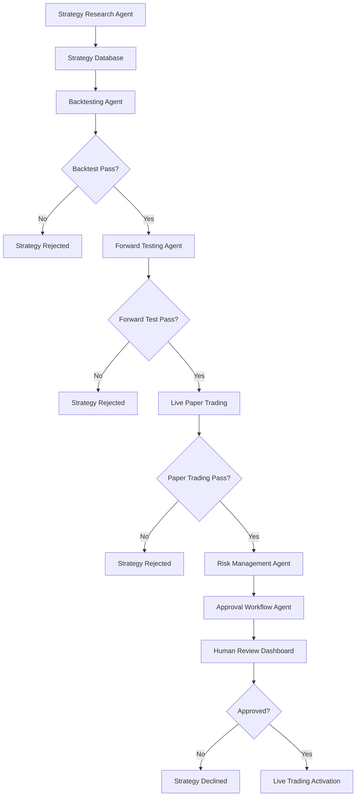

# Comprehensive API Integration & QuantTrade Implementation Plan

## Executive Summary

This document outlines the strategic implementation plan for dynamic content integration across all frontend projects and the development of a personal quantitative trading platform (QuantTrade) powered by AI agents.

---

## **PHASE 1: FREE API INTEGRATION STRATEGY**

### **Business Directory APIs (FREE Priority)**

#### **Primary Free APIs**
1. **OpenStreetMap Nominatim**
   - **Cost**: 100% Free
   - **Rate Limit**: 1 request/second (respectful usage)
   - **Coverage**: Global, 30M queries/day capacity
   - **Data**: Basic business location, address, coordinates
   - **Implementation**: Direct REST API integration

2. **OpenStreetMap Overpass API**
   - **Cost**: 100% Free
   - **Coverage**: Detailed POI data globally
   - **Data**: Business categories, opening hours, contact info
   - **Implementation**: Query-based data extraction

3. **LocationIQ (Free Tier)**
   - **Cost**: 5,000 requests/day free
   - **Features**: Geocoding, reverse geocoding, place search
   - **Advantage**: 90% cheaper than Google Places

#### **Fallback APIs**
- **Foursquare Places API**: Limited free tier for enhanced data
- **MapBox Places**: 100,000 free requests/month

#### **Data Combination Strategy**
```python
# Multi-API Business Data Schema
{
    "business_id": "unique_generated_id",
    "name": "from_nominatim",
    "address": "from_nominatim",
    "coordinates": "from_nominatim",
    "category": "from_overpass",
    "hours": "from_overpass",
    "contact": "from_overpass",
    "reviews": "from_foursquare_fallback",
    "cached_at": "timestamp",
    "sources": ["nominatim", "overpass", "foursquare"]
}
```

### **Gaming APIs (FREE Priority)**

#### **Primary Free APIs**
1. **IGDB (via Twitch)**
   - **Cost**: Free with Twitch Developer Account
   - **Rate Limit**: 4 requests/second
   - **Coverage**: Comprehensive gaming database
   - **Data**: Games, developers, publishers, reviews, screenshots

2. **Steam Web API**
   - **Cost**: Free
   - **Coverage**: Steam store data
   - **Data**: Game details, user libraries, achievements

3. **OpenCritic API**
   - **Cost**: Free tier available
   - **Data**: Game reviews and scores

#### **Gaming Data Schema**
```python
{
    "game_id": "unique_generated_id",
    "name": "from_igdb",
    "description": "from_igdb",
    "genres": "from_igdb",
    "platforms": "from_igdb",
    "steam_data": "from_steam_api",
    "reviews": "from_opencritic",
    "media": "from_igdb",
    "cached_at": "timestamp",
    "sources": ["igdb", "steam", "opencritic"]
}
```

### **Smart Caching Strategy**

#### **Local Database Design**
```sql
-- Universal caching table
CREATE TABLE api_cache (
    id SERIAL PRIMARY KEY,
    cache_key VARCHAR(255) UNIQUE,
    source_apis JSON,
    data JSONB,
    expires_at TIMESTAMP,
    hit_count INTEGER DEFAULT 0,
    created_at TIMESTAMP DEFAULT NOW(),
    updated_at TIMESTAMP DEFAULT NOW()
);

-- Business-specific cache
CREATE TABLE businesses_cache (
    id SERIAL PRIMARY KEY,
    search_query VARCHAR(255),
    location VARCHAR(255),
    results JSONB,
    expires_at TIMESTAMP,
    created_at TIMESTAMP DEFAULT NOW()
);

-- Gaming-specific cache
CREATE TABLE games_cache (
    id SERIAL PRIMARY KEY,
    game_identifier VARCHAR(255),
    platform VARCHAR(100),
    game_data JSONB,
    expires_at TIMESTAMP,
    created_at TIMESTAMP DEFAULT NOW()
);
```

#### **Caching Logic**
1. **Search First**: Check local cache before API calls
2. **Intelligent Expiry**:
   - Business data: 7 days (POI changes slowly)
   - Gaming data: 30 days (game info is static)
   - Price data: 1 hour (dynamic pricing)
3. **Progressive Building**: Store all search results to build comprehensive local database
4. **API Optimization**: Combine multiple API responses into single cached record

---

## **PHASE 2: QUANTTRADE AI TRADING PLATFORM**

### **Project Architecture**

#### **Core AI Agents**
1. **Strategy Research Agent**
   - **Role**: Scan online sources for trading strategies
   - **Sources**: QuantConnect, GitHub, research papers, forums
   - **Output**: Categorized strategy database

2. **Backtesting Agent**
   - **Role**: Implement and test strategies using VectorBT
   - **Framework**: VectorBT (chosen for speed and scalability)
   - **Metrics**: Sharpe ratio, max drawdown, win rate, profit factor

3. **Forward Testing Agent**
   - **Role**: Paper trading with live data
   - **Duration**: 30-90 days per strategy
   - **Validation**: Real-time performance tracking

4. **Risk Management Agent**
   - **Role**: Portfolio risk assessment and position sizing
   - **Metrics**: VaR, correlation analysis, volatility monitoring

5. **Approval Workflow Agent**
   - **Role**: Human-in-the-loop approval system
   - **Features**: Detailed reports, risk assessment, recommendation

### **Cryptocurrency Trading APIs (FREE)**

#### **Primary Data Sources**
1. **CoinGecko API**
   - **Cost**: Free tier (30 calls/min)
   - **Coverage**: 17M+ coins across 253 networks
   - **Data**: Real-time prices, historical OHLCV, market cap, volume

2. **CoinMarketCap API**
   - **Cost**: Free tier with basic data
   - **Coverage**: Industry standard data
   - **Data**: Real-time prices, market data, rankings

3. **Binance Public API**
   - **Cost**: Free for market data
   - **Coverage**: Largest crypto exchange
   - **Data**: Real-time prices, order book, klines

#### **Backtesting Framework: VectorBT**

**Why VectorBT:**
- **Speed**: Vectorized operations using NumPy + Numba
- **Scalability**: Test thousands of strategies in seconds
- **Modern**: Built for 2025+ with active development
- **Integration**: Works with Plotly for interactive dashboards

```python
# VectorBT Implementation Example
import vectorbt as vbt
import pandas as pd

# Strategy backtesting pipeline
def backtest_strategy(data, strategy_func, params):
    # Vectorized backtesting
    entries, exits = strategy_func(data, **params)
    portfolio = vbt.Portfolio.from_signals(
        data['close'], entries, exits
    )

    return {
        'total_return': portfolio.total_return(),
        'sharpe_ratio': portfolio.sharpe_ratio(),
        'max_drawdown': portfolio.max_drawdown(),
        'win_rate': portfolio.win_rate()
    }
```

### **Trading Workflow Pipeline**



### **Success Criteria & Thresholds**

#### **Backtesting Thresholds**
- **Minimum Sharpe Ratio**: 1.5+
- **Maximum Drawdown**: <15%
- **Win Rate**: >55%
- **Minimum Trades**: 100+ for statistical significance
- **Backtest Period**: Minimum 2 years of data

#### **Forward Testing Thresholds**
- **Performance Consistency**: Within 20% of backtest results
- **Risk Management**: No single day loss >5%
- **Duration**: 30-90 days depending on strategy frequency

### **Frontend Dashboard Design**

#### **Private Authentication**
- **Separate Login System**: Independent from main platform
- **2FA Required**: Enhanced security for trading platform
- **Session Management**: Auto-logout after inactivity

#### **Dashboard Features**
1. **Strategy Performance Monitor**
   - Real-time P&L tracking
   - Risk metrics dashboard
   - Portfolio allocation charts

2. **Research Pipeline Status**
   - Active strategies in testing
   - Backtest results summary
   - Forward test progress

3. **Approval Queue**
   - Strategies pending approval
   - Detailed analysis reports
   - Risk assessment summaries

4. **Live Trading Monitor**
   - Active positions
   - Daily/weekly performance
   - Risk alerts and notifications

### **Technology Stack**

#### **Backend (Port 8012 - QuantTrade)**
- **Framework**: FastAPI
- **Database**: PostgreSQL with TimescaleDB for time-series
- **Queue**: Celery + Redis for async strategy processing
- **ML/Analytics**: VectorBT + pandas + NumPy

#### **Frontend (Port 3012 - QuantTrade Dashboard)**
- **Framework**: Next.js 15
- **Charts**: TradingView lightweight charts
- **UI**: Tailwind CSS + Shadcn/ui
- **Real-time**: WebSocket connections

#### **AI Agents**
- **Framework**: CrewAI (existing integration)
- **Models**: Multiple LLM providers via smart router
- **Automation**: Temporal workflows for orchestration

---

## **PHASE 3: DYNAMIC CONTENT INTEGRATION**

### **Bizoholic (Port 3000) + Wagtail CMS**

#### **Integration Points**
```javascript
// Dynamic content from Wagtail
const getBlogPosts = async () => {
  const response = await fetch('http://bizosaas-wagtail-cms-8002:4000/api/v2/pages/?type=blog.BlogPage');
  return response.json();
};

const getServices = async () => {
  const response = await fetch('http://bizosaas-wagtail-cms-8002:4000/api/v2/pages/?type=services.ServicePage');
  return response.json();
};
```

### **CorelDove (Port 3002) + Wagtail + Saleor**

#### **Dual Backend Strategy**
```javascript
// Product catalog from Saleor
const getProducts = async () => {
  const response = await fetch('http://bizosaas-saleor-unified:8000/graphql/', {
    method: 'POST',
    headers: { 'Content-Type': 'application/json' },
    body: JSON.stringify({
      query: `query { products(first: 20) { edges { node { id name description pricing { priceRange { start { gross { amount } } } } } } } }`
    })
  });
  return response.json();
};

// Content from Wagtail
const getProductCategories = async () => {
  const response = await fetch('http://bizosaas-wagtail-cms-8002:4000/api/v2/pages/?type=products.CategoryPage');
  return response.json();
};
```

### **Business Directory (Port 3004) + Multi-API**

#### **Smart Search Implementation**
```python
async def search_businesses(query: str, location: str):
    # Check cache first
    cached = await get_cached_businesses(query, location)
    if cached and not is_expired(cached):
        return cached.results

    # Multi-API search
    results = []

    # Primary: Nominatim
    nominatim_results = await search_nominatim(query, location)
    results.extend(nominatim_results)

    # Secondary: Overpass for details
    for business in results:
        details = await get_overpass_details(business.coordinates)
        business.update(details)

    # Cache results
    await cache_business_results(query, location, results)

    return results
```

### **ThrillRing (Port 3005) + Gaming APIs**

#### **Game Discovery Implementation**
```python
async def search_games(query: str):
    # Check cache
    cached = await get_cached_games(query)
    if cached and not is_expired(cached):
        return cached.results

    # Multi-API aggregation
    results = []

    # Primary: IGDB
    igdb_results = await search_igdb(query)
    results.extend(igdb_results)

    # Enhance with Steam data
    for game in results:
        if game.steam_id:
            steam_data = await get_steam_details(game.steam_id)
            game.update_steam_data(steam_data)

    # Add review scores from OpenCritic
    for game in results:
        reviews = await get_opencritic_scores(game.name)
        game.add_review_scores(reviews)

    # Cache aggregated results
    await cache_game_results(query, results)

    return results
```

---

## **PHASE 4: UNIFIED API GATEWAY**

### **FastAPI Central Router (Port 8001)**

#### **Intelligent Routing**
```python
# Smart routing through AI gateway
@app.post("/api/search/{platform}")
async def unified_search(platform: str, query: SearchQuery):
    # Route to appropriate service
    if platform == "business":
        return await business_directory_service.search(query)
    elif platform == "gaming":
        return await gaming_service.search(query)
    elif platform == "trading":
        return await quanttrade_service.analyze(query)

    # AI-powered query understanding
    intent = await ai_agent.understand_query(query.text)
    return await route_by_intent(intent, query)
```

### **Resource Optimization**

#### **API Cost Management**
- **Request Batching**: Combine multiple queries into single API calls
- **Intelligent Caching**: Expire cache based on data freshness needs
- **Rate Limiting**: Respect API limits with queuing system
- **Fallback Strategy**: Switch to backup APIs when primary fails

#### **Performance Monitoring**
```python
# API performance tracking
class APIMetrics:
    def __init__(self):
        self.response_times = {}
        self.success_rates = {}
        self.cache_hit_rates = {}

    async def track_request(self, api_name: str, response_time: float, success: bool):
        # Update metrics for optimization
        pass
```

---

## **IMPLEMENTATION TIMELINE**

### **Week 1-2: Foundation**
- [ ] Setup QuantTrade backend service (Port 8012)
- [ ] Implement VectorBT backtesting framework
- [ ] Create QuantTrade frontend dashboard (Port 3012)
- [ ] Setup separate authentication system

### **Week 3-4: API Integration**
- [ ] Integrate free business directory APIs
- [ ] Implement gaming APIs integration
- [ ] Setup smart caching system
- [ ] Create unified data schemas

### **Week 5-6: AI Agents**
- [ ] Develop Strategy Research Agent
- [ ] Implement Backtesting Agent
- [ ] Create Forward Testing Agent
- [ ] Build Approval Workflow Agent

### **Week 7-8: Dynamic Content**
- [ ] Connect Bizoholic to Wagtail
- [ ] Setup CorelDove dual backend
- [ ] Implement business directory search
- [ ] Create gaming discovery system

### **Week 9-10: Testing & Optimization**
- [ ] End-to-end testing of all systems
- [ ] Performance optimization
- [ ] Security audit
- [ ] Documentation completion

---

## **SUCCESS METRICS**

### **API Performance**
- **Cache Hit Rate**: >80%
- **API Cost Reduction**: >60% vs premium APIs
- **Response Time**: <200ms for cached, <2s for API calls
- **Data Completeness**: >90% for combined API results

### **QuantTrade Performance**
- **Strategy Success Rate**: >30% pass all stages
- **Backtest Accuracy**: Within 15% of forward test results
- **Risk Management**: Zero strategies exceed risk thresholds
- **User Approval Rate**: >90% of recommended strategies approved

### **User Experience**
- **Frontend Load Time**: <3 seconds
- **Search Response**: <500ms
- **Data Freshness**: >95% accurate vs real-time sources
- **System Uptime**: >99.9%

---

## **RISK MITIGATION**

### **API Reliability**
- **Multiple Fallbacks**: 3+ data sources per category
- **Graceful Degradation**: Partial results when some APIs fail
- **Rate Limit Monitoring**: Proactive quota management
- **Error Recovery**: Automatic retry with exponential backoff

### **Trading Risk**
- **Extensive Testing**: Multi-stage validation before live trading
- **Position Limits**: Maximum risk per trade and portfolio
- **Stop Losses**: Automatic risk management
- **Human Oversight**: Manual approval for all live strategies

### **Data Security**
- **API Key Rotation**: Regular credential updates
- **Data Encryption**: All sensitive data encrypted at rest
- **Access Logging**: Audit trail for all API access
- **Backup Strategy**: Multiple backup locations for critical data

---

*This plan provides a comprehensive roadmap for implementing dynamic content integration and building a sophisticated quantitative trading platform while prioritizing cost-effective free API solutions and maintaining high performance standards.*