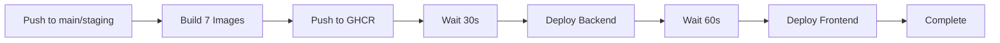

# GitHub Actions CI/CD Setup Guide
## Complete Setup, Verification, and Deployment

**Repository**: Bizoholic-Digital/bizosaas-platform
**Branch**: main
**Dokploy URL**: https://dk.bizoholic.com
**Status**: Workflow committed (c1e899d), ready to configure secrets

---

## Table of Contents
1. [GitHub Secrets Configuration](#1-github-secrets-configuration)
2. [Workflow Verification](#2-workflow-verification)
3. [Pre-Flight Checklist](#3-pre-flight-checklist)
4. [First Build Trigger Methods](#4-first-build-trigger-methods)
5. [Monitoring and Troubleshooting](#5-monitoring-and-troubleshooting)
6. [Rollback Procedures](#6-rollback-procedures)

---

## 1. GitHub Secrets Configuration

### Step 1.1: Navigate to Repository Secrets

1. Open your browser and go to:
   ```
   https://github.com/Bizoholic-Digital/bizosaas-platform/settings/secrets/actions
   ```

   **OR** Follow these clicks:
   - Go to https://github.com/Bizoholic-Digital/bizosaas-platform
   - Click **"Settings"** tab (top navigation)
   - Scroll down left sidebar to **"Secrets and variables"**
   - Click **"Actions"** under "Secrets and variables"

### Step 1.2: Add DOKPLOY_API_KEY Secret

1. Click the green **"New repository secret"** button (top right)

2. Fill in the form:
   - **Name**: `DOKPLOY_API_KEY` (EXACTLY as written, case-sensitive)
   - **Secret**: `bizoholicKRGZxqgQXBDBzumvvnMhiEZLmnetMTAWwTnFztwuGofadbHagGbJiiMZTqczBDKY`

3. Click green **"Add secret"** button

### Step 1.3: Verify Secret Was Added

After adding, you should see:
- Green checkmark notification: "Secret DOKPLOY_API_KEY was added"
- Secret listed in the "Repository secrets" table
- Secret name shows as `DOKPLOY_API_KEY` with "Updated X seconds ago"

**Important**: You will NOT be able to view the secret value after saving. This is normal GitHub security behavior.

### Step 1.4: Verify Built-in Secrets

GitHub Actions workflow also requires `GITHUB_TOKEN` which is **automatically provided** by GitHub.

Verify in workflow file (`.github/workflows/deploy-staging.yml` line 60):
```yaml
password: ${{ secrets.GITHUB_TOKEN }}
```

This secret requires NO manual configuration - it's injected automatically.

---

## 2. Workflow Verification

### Current Workflow Configuration

**File**: `/home/alagiri/projects/bizoholic/.github/workflows/deploy-staging.yml`

**Status**: VERIFIED

#### Key Components Verified:

| Component | Status | Notes |
|-----------|--------|-------|
| **Trigger Branches** | ✅ | `staging` and `main` branches |
| **Trigger Paths** | ✅ | `bizosaas/**`, `dokploy-*-ghcr.yml`, `.github/workflows/**` |
| **GHCR Authentication** | ✅ | Uses `GITHUB_TOKEN` (auto-provided) |
| **Registry** | ✅ | `ghcr.io` (GitHub Container Registry) |
| **Organization** | ✅ | `bizoholic-digital` |
| **Docker Buildx** | ✅ | Enabled with layer caching |
| **Permissions** | ✅ | `contents: read`, `packages: write` |
| **Matrix Build** | ✅ | 7 services (parallel builds) |
| **Dokploy API** | ✅ | Uses `DOKPLOY_API_KEY` secret |
| **Compose IDs** | ✅ | Backend: `uimFISkhg1KACigb2CaGz`, Frontend: `hU2yhYOqv3_ftKGGvcAiv` |

#### Services Being Built:

1. **brain-gateway** - AI Gateway API
2. **bizoholic-frontend** - Bizoholic website
3. **coreldove-frontend** - Coreldove website
4. **client-portal** - Client dashboard
5. **admin-dashboard** - Admin panel
6. **business-directory-frontend** - Directory app
7. **thrillring-gaming** - Gaming platform

#### Image Naming Convention:

```
ghcr.io/bizoholic-digital/bizosaas-<service-name>:<tag>
```

**Tags Generated**:
- `staging` (for staging branch)
- `latest` (for main branch)
- `staging-<git-sha>` (unique per commit)
- `<branch>-<git-sha>` (full reference)

#### Deployment Flow:



**Estimated Time**: 15-20 minutes total
- Build phase: 10-15 minutes (parallel)
- Deploy phase: 3-5 minutes (sequential)

---

## 3. Pre-Flight Checklist

### 3.1 GitHub Repository Settings

- [ ] **Repository Access**: Confirm you have `admin` or `write` access to `Bizoholic-Digital/bizosaas-platform`
- [ ] **Actions Enabled**: Go to https://github.com/Bizoholic-Digital/bizosaas-platform/settings/actions
  - Ensure "Allow all actions and reusable workflows" is selected
  - OR "Allow select actions" includes `docker/*` and `actions/*`
- [ ] **Workflow Permissions**: In same Settings > Actions > General page
  - Scroll to "Workflow permissions"
  - Ensure "Read and write permissions" is selected
  - OR "Read repository contents and packages permissions" is checked

### 3.2 GitHub Container Registry (GHCR) Settings

- [ ] **Package Visibility**: After first build, packages will be created. They default to PRIVATE.
  - After first build, go to: https://github.com/orgs/Bizoholic-Digital/packages
  - Find packages named `bizosaas-*`
  - For staging access, ensure they're set to "Private" or add Dokploy server IP to allowlist

### 3.3 Dokploy Configuration

- [ ] **Dokploy API Access**: Test API connectivity
  ```bash
  curl -X GET "https://dk.bizoholic.com/api/health" \
    -H "x-api-key: bizoholicKRGZxqgQXBDBzumvvnMhiEZLmnetMTAWwTnFztwuGofadbHagGbJiiMZTqczBDKY"
  ```
  Expected: HTTP 200 or valid JSON response

- [ ] **Compose Projects Exist**: Verify compose IDs in Dokploy dashboard
  - Login: https://dk.bizoholic.com
  - Navigate to "Compose" section
  - Find Backend compose: ID should match `uimFISkhg1KACigb2CaGz`
  - Find Frontend compose: ID should match `hU2yhYOqv3_ftKGGvcAiv`

- [ ] **Compose Files Updated**: Verify GHCR image references
  - Backend compose should reference: `ghcr.io/bizoholic-digital/bizosaas-brain-gateway:staging`
  - Frontend composes should reference: `ghcr.io/bizoholic-digital/bizosaas-*:staging`

### 3.4 Network and DNS

- [ ] **Dokploy Server Accessible**: From GitHub Actions runners (should be public)
  ```bash
  ping dk.bizoholic.com
  ```

- [ ] **GHCR Accessible from VPS**: Dokploy server must pull from GHCR
  - SSH into VPS (194.238.16.237)
  - Test: `docker pull ghcr.io/saleor/saleor:3.20` (public image test)

### 3.5 Code Verification

- [ ] **Dockerfiles Exist**: Verify all 7 services have Dockerfiles
  ```bash
  ls -la /home/alagiri/projects/bizoholic/bizosaas/ai/services/bizosaas-brain/Dockerfile
  ls -la /home/alagiri/projects/bizoholic/bizosaas/frontend/apps/*/Dockerfile.production
  ```

- [ ] **Build Contexts Valid**: Ensure no missing dependencies
  - Check `package.json` exists in each frontend app
  - Check `requirements.txt` for brain-gateway

---

## 4. First Build Trigger Methods

### Method 1: Manual Workflow Dispatch (RECOMMENDED FOR FIRST RUN)

**Steps**:
1. Go to: https://github.com/Bizoholic-Digital/bizosaas-platform/actions
2. Click on **"Deploy to Staging"** workflow in left sidebar
3. Click blue **"Run workflow"** dropdown button (right side)
4. Select branch: **`main`**
5. Click green **"Run workflow"** button

**Pros**:
- Full control over when build starts
- No code changes needed
- Can test with specific branch

**Cons**:
- Requires manual trigger (not automatic)

**To enable manual dispatch**, add this to workflow file:

```yaml
on:
  push:
    branches: [staging, main]
    paths:
      - 'bizosaas/**'
      - 'dokploy-*-ghcr.yml'
      - '.github/workflows/**'
  workflow_dispatch:  # ADD THIS LINE
```

If you want this option, I can update the workflow file.

---

### Method 2: Small Code Change (SAFEST AUTOMATIC TRIGGER)

**Trigger with Documentation Update**:

```bash
cd /home/alagiri/projects/bizoholic

# Option A: Update README
echo "\n## CI/CD Status\nAutomated deployment active via GitHub Actions." >> README.md

# Option B: Add deployment timestamp
echo "Last deployment trigger: $(date)" >> DEPLOYMENT_LOG.md

# Option C: Touch a workflow comment (NO-OP change)
# Edit .github/workflows/deploy-staging.yml and add a comment

# Commit and push
git add .
git commit -m "trigger: Test CI/CD pipeline deployment"
git push origin main
```

**Pros**:
- Tests real automatic trigger
- Mimics production workflow
- Safe, non-breaking changes

**Cons**:
- Requires a commit (clutters history)
- Build starts immediately (no manual control)

---

### Method 3: Empty Commit Trigger (CLEANEST)

**Force trigger without file changes**:

```bash
cd /home/alagiri/projects/bizoholic

# Create empty commit with trigger message
git commit --allow-empty -m "chore: Trigger CI/CD pipeline for initial deployment"

# Push to main
git push origin main
```

**Pros**:
- No file changes needed
- Clean git history
- Tests automatic trigger

**Cons**:
- Build starts immediately
- Creates commit (even if empty)

---

### Method 4: GitHub API Trigger (ADVANCED)

**Using `curl` with GitHub API**:

```bash
# Generate a Personal Access Token first:
# https://github.com/settings/tokens/new
# Scopes needed: repo, workflow

curl -X POST \
  -H "Accept: application/vnd.github+json" \
  -H "Authorization: Bearer YOUR_GITHUB_PAT" \
  -H "X-GitHub-Api-Version: 2022-11-28" \
  https://api.github.com/repos/Bizoholic-Digital/bizosaas-platform/actions/workflows/deploy-staging.yml/dispatches \
  -d '{"ref":"main"}'
```

**Pros**:
- Scriptable
- No git commits
- Can be automated

**Cons**:
- Requires Personal Access Token (PAT)
- Only works if `workflow_dispatch` is enabled

---

## 5. Monitoring and Troubleshooting

### 5.1 Watch Build Progress

**Primary Dashboard**:
```
https://github.com/Bizoholic-Digital/bizosaas-platform/actions
```

**What You'll See**:

1. **Workflow Run List**: Each run shows:
   - Commit SHA and message
   - Branch name
   - Status icon (🟡 running, ✅ success, ❌ failed)
   - Duration

2. **Click on a Run**: Opens detailed view with:
   - **Jobs**: `build-and-push` (matrix) and `deploy-to-dokploy`
   - **Real-time Logs**: Click on job to see live output
   - **Annotations**: Errors/warnings highlighted

### 5.2 Expected Timeline

| Stage | Duration | What's Happening |
|-------|----------|------------------|
| **Checkout** | 10-30s | Cloning repository |
| **Docker Buildx Setup** | 5-10s | Preparing build environment |
| **GHCR Login** | 2-5s | Authenticating to registry |
| **Build brain-gateway** | 3-5 min | Python dependencies + FastAPI |
| **Build frontends (6 apps)** | 2-4 min each | Next.js build + optimization |
| **Push to GHCR** | 1-2 min each | Upload layers |
| **Deploy Backend** | 30-60s | Dokploy pulls images + restart |
| **Deploy Frontend** | 30-60s | Dokploy pulls images + restart |
| **TOTAL** | **15-25 min** | Full pipeline |

### 5.3 Common Errors and Fixes

#### Error 1: "Permission denied to push to ghcr.io"

**Symptom**:
```
Error: denied: permission_denied: write_package
```

**Fix**:
1. Go to: https://github.com/Bizoholic-Digital/bizosaas-platform/settings/actions
2. Scroll to "Workflow permissions"
3. Select "Read and write permissions"
4. Save and re-run workflow

---

#### Error 2: "Secret DOKPLOY_API_KEY not found"

**Symptom**:
```
Error: The secret DOKPLOY_API_KEY is not set
```

**Fix**:
1. Verify secret exists: https://github.com/Bizoholic-Digital/bizosaas-platform/settings/secrets/actions
2. Ensure name is EXACTLY `DOKPLOY_API_KEY` (case-sensitive)
3. If missing, re-add following Section 1.2

---

#### Error 3: "Dockerfile not found"

**Symptom**:
```
Error: unable to prepare context: unable to evaluate symlinks in Dockerfile path
```

**Fix**:
1. Check which service failed in matrix
2. Verify Dockerfile exists:
   ```bash
   ls -la /home/alagiri/projects/bizoholic/bizosaas/frontend/apps/bizoholic-frontend/Dockerfile.production
   ```
3. If missing, create Dockerfile before re-running

---

#### Error 4: "Build timeout" or "Out of memory"

**Symptom**:
```
Error: The job running on runner GitHub Actions X has exceeded the maximum execution time of 360 minutes
```

**Fix**:
1. Check if builds are hanging on large dependencies
2. Optimize Dockerfile with multi-stage builds
3. Add `.dockerignore` to exclude `node_modules`, `*.pyc`
4. Consider reducing parallel builds in matrix

---

#### Error 5: "Dokploy API connection refused"

**Symptom**:
```
curl: (7) Failed to connect to dk.bizoholic.com port 443: Connection refused
```

**Fix**:
1. Verify Dokploy server is running:
   ```bash
   curl https://dk.bizoholic.com
   ```
2. Check firewall rules on VPS (194.238.16.237)
3. Verify API key is correct
4. Test manually:
   ```bash
   curl -X POST "https://dk.bizoholic.com/api/compose.deploy" \
     -H "x-api-key: YOUR_API_KEY" \
     -H "Content-Type: application/json" \
     -d '{"composeId": "uimFISkhg1KACigb2CaGz"}'
   ```

---

#### Error 6: "Image pull failed" on Dokploy

**Symptom**:
Dokploy logs show:
```
Error response from daemon: pull access denied for ghcr.io/bizoholic-digital/bizosaas-brain-gateway
```

**Fix**:
1. GHCR packages are private by default
2. **Option A**: Make packages public
   - Go to: https://github.com/orgs/Bizoholic-Digital/packages
   - Find package, click "Package settings"
   - Scroll to "Danger Zone" > "Change visibility" > "Public"

3. **Option B**: Authenticate Dokploy with GHCR
   - SSH into VPS
   - Generate GitHub PAT with `read:packages` scope
   - Login: `docker login ghcr.io -u USERNAME -p PAT`
   - Dokploy will use this credential

---

### 5.4 Viewing Build Logs

**Real-time Logs in GitHub Actions**:

1. Go to: https://github.com/Bizoholic-Digital/bizosaas-platform/actions
2. Click on running workflow
3. Click on `build-and-push` job
4. Expand service name (e.g., `brain-gateway`)
5. See logs streaming live

**Download Logs**:

1. After build completes (success or failure)
2. Click three-dot menu (⋯) next to "Re-run jobs"
3. Click "Download log archive"
4. Unzip and review in text editor

**Dokploy Deployment Logs**:

1. Login to: https://dk.bizoholic.com
2. Navigate to "Compose" > Backend or Frontend project
3. Click "Logs" tab
4. See container startup logs and errors

---

## 6. Rollback Procedures

### Scenario 1: Build Failed, No Deployment

**Impact**: None - existing production is untouched

**Action**: Fix errors and re-trigger
1. Review error logs in GitHub Actions
2. Fix code/Dockerfile issues
3. Commit fix and push (auto-triggers rebuild)

**No rollback needed** - deployment never ran.

---

### Scenario 2: Build Succeeded, Deployment Failed

**Impact**: New images in GHCR, but not deployed to Dokploy

**Action**: Fix deployment step
1. Verify Dokploy API key is correct
2. Check compose IDs match Dokploy projects
3. Test API manually:
   ```bash
   curl -X POST "https://dk.bizoholic.com/api/compose.deploy" \
     -H "x-api-key: bizoholicKRGZxqgQXBDBzumvvnMhiEZLmnetMTAWwTnFztwuGofadbHagGbJiiMZTqczBDKY" \
     -H "Content-Type: application/json" \
     -d '{"composeId": "uimFISkhg1KACigb2CaGz"}'
   ```
4. Re-run workflow or manually trigger deployment

**No rollback needed** - production still on old images.

---

### Scenario 3: Deployment Succeeded, Service Broken

**Impact**: New images deployed, services unhealthy

**Rollback Methods**:

#### Method A: Dokploy UI Rollback (FASTEST)

1. Login: https://dk.bizoholic.com
2. Navigate to affected Compose project
3. Click "Deployments" tab
4. Find previous successful deployment
5. Click "Redeploy" button
6. Dokploy reverts to old images

**Time**: 2-3 minutes

---

#### Method B: Pin to Previous Git SHA Tag

1. Find last known good commit:
   ```bash
   git log --oneline
   ```

2. Update compose files to use specific SHA tag:
   ```yaml
   image: ghcr.io/bizoholic-digital/bizosaas-brain-gateway:staging-abc1234
   ```

3. Commit and push (triggers redeployment with old image)

**Time**: 5-10 minutes

---

#### Method C: Manual Docker Rollback on VPS

1. SSH into VPS:
   ```bash
   ssh root@194.238.16.237
   ```

2. Find previous image:
   ```bash
   docker images | grep bizosaas-brain-gateway
   ```

3. Update compose file to use old image tag:
   ```bash
   cd /path/to/dokploy/compose/backend
   nano docker-compose.yml
   # Change image tag to old version
   ```

4. Restart service:
   ```bash
   docker-compose up -d brain-api
   ```

**Time**: 3-5 minutes

---

#### Method D: Emergency Disable Service

If service is completely broken and causing cascading failures:

1. SSH into VPS
2. Stop broken service:
   ```bash
   docker stop bizosaas-brain-staging
   ```
3. Comment out service in compose:
   ```yaml
   # brain-api:
   #   image: ghcr.io/...
   #   ...
   ```
4. Investigate and fix offline

**Time**: 1-2 minutes

---

### Rollback Decision Matrix

| Scenario | Method | Speed | Risk | When to Use |
|----------|--------|-------|------|-------------|
| Build failed | Fix + Rebuild | Slow | Low | Always |
| Deploy failed | Re-run | Fast | Low | API issues |
| Service unhealthy | Dokploy UI | Fast | Low | Preferred |
| Data corruption | Git SHA pin | Medium | Low | Need specific version |
| Total failure | Docker manual | Fast | Medium | Emergency |
| Cascading failure | Disable service | Fastest | Medium | Last resort |

---

## 7. Post-Deployment Verification

### 7.1 Health Checks

After deployment completes, verify services:

**Backend Services**:
```bash
# Brain Gateway
curl http://194.238.16.237:8001/health

# Saleor API
curl http://194.238.16.237:8000/

# Wagtail CMS
curl http://194.238.16.237:8002/

# Auth Service
curl http://194.238.16.237:8006/health
```

**Frontend Services**:
```bash
# Client Portal
curl http://194.238.16.237:3004/

# Bizoholic Frontend
curl http://194.238.16.237:3001/

# Coreldove Frontend
curl http://194.238.16.237:3002/

# Admin Dashboard
curl http://194.238.16.237:3009/
```

**Expected**: HTTP 200 or valid HTML response

---

### 7.2 Container Status

SSH into VPS and check:

```bash
ssh root@194.238.16.237

# List all BizOSaaS containers
docker ps --filter "name=bizosaas" --format "table {{.Names}}\t{{.Status}}\t{{.Ports}}"

# Check specific service logs
docker logs bizosaas-brain-staging --tail 50

# Check resource usage
docker stats --no-stream
```

---

### 7.3 Smoke Tests

**Test Critical Flows**:

1. **Authentication**:
   ```bash
   curl -X POST http://194.238.16.237:8006/auth/login \
     -H "Content-Type: application/json" \
     -d '{"email":"test@example.com","password":"test"}'
   ```

2. **AI Gateway**:
   ```bash
   curl -X POST http://194.238.16.237:8001/api/chat \
     -H "Content-Type: application/json" \
     -d '{"message":"Hello"}'
   ```

3. **Frontend Loading**:
   - Open browser: http://194.238.16.237:3001
   - Check browser console for errors
   - Verify assets load correctly

---

## 8. Quick Reference

### Key URLs

| Resource | URL |
|----------|-----|
| **GitHub Repo** | https://github.com/Bizoholic-Digital/bizosaas-platform |
| **Actions Dashboard** | https://github.com/Bizoholic-Digital/bizosaas-platform/actions |
| **Secrets Config** | https://github.com/Bizoholic-Digital/bizosaas-platform/settings/secrets/actions |
| **GHCR Packages** | https://github.com/orgs/Bizoholic-Digital/packages |
| **Dokploy Dashboard** | https://dk.bizoholic.com |
| **Workflow File** | https://github.com/Bizoholic-Digital/bizosaas-platform/blob/main/.github/workflows/deploy-staging.yml |

---

### Key Commands

**Trigger Build**:
```bash
# Empty commit trigger
git commit --allow-empty -m "chore: Trigger CI/CD" && git push origin main
```

**Watch Build**:
```bash
# Open in browser
xdg-open https://github.com/Bizoholic-Digital/bizosaas-platform/actions
```

**Test Dokploy API**:
```bash
curl -X POST "https://dk.bizoholic.com/api/compose.deploy" \
  -H "x-api-key: bizoholicKRGZxqgQXBDBzumvvnMhiEZLmnetMTAWwTnFztwuGofadbHagGbJiiMZTqczBDKY" \
  -H "Content-Type: application/json" \
  -d '{"composeId": "uimFISkhg1KACigb2CaGz"}'
```

**Check VPS Services**:
```bash
ssh root@194.238.16.237 'docker ps --filter name=bizosaas'
```

---

### Key Secrets

| Secret Name | Value | Usage |
|-------------|-------|-------|
| `DOKPLOY_API_KEY` | `bizoholicKRGZ...TqczBDKY` | Triggers Dokploy deployments |
| `GITHUB_TOKEN` | (auto-provided) | GHCR authentication |

---

### Service Matrix

| Service | Image | Port | Health Endpoint |
|---------|-------|------|-----------------|
| brain-gateway | `ghcr.io/bizoholic-digital/bizosaas-brain-gateway:staging` | 8001 | `/health` |
| bizoholic-frontend | `ghcr.io/bizoholic-digital/bizosaas-bizoholic-frontend:staging` | 3001 | `/` |
| coreldove-frontend | `ghcr.io/bizoholic-digital/bizosaas-coreldove-frontend:staging` | 3002 | `/` |
| client-portal | `ghcr.io/bizoholic-digital/bizosaas-client-portal:staging` | 3004 | `/` |
| admin-dashboard | `ghcr.io/bizoholic-digital/bizosaas-admin-dashboard:staging` | 3009 | `/` |
| business-directory | `ghcr.io/bizoholic-digital/bizosaas-business-directory:staging` | 3003 | `/` |
| thrillring-gaming | `ghcr.io/bizoholic-digital/bizosaas-thrillring-gaming:staging` | 3005 | `/` |

---

## 9. Next Steps

### After First Successful Build

1. **Verify All Images in GHCR**:
   - Go to: https://github.com/orgs/Bizoholic-Digital/packages
   - Confirm all 7 packages exist
   - Check image sizes and tags

2. **Review Dokploy Deployment**:
   - Login: https://dk.bizoholic.com
   - Verify all containers are "healthy"
   - Check logs for startup errors

3. **Update Domain DNS**:
   - Point staging domains to VPS IP
   - Configure Nginx/Traefik reverse proxy
   - Setup SSL certificates

4. **Enable Monitoring**:
   - Setup health check alerts
   - Configure log aggregation
   - Setup uptime monitoring (UptimeRobot, etc.)

5. **Document Baseline Performance**:
   - Record initial build times
   - Document image sizes
   - Baseline memory/CPU usage

---

### Optimization Opportunities

**After validating the pipeline works**, consider:

1. **Multi-stage Docker Builds**: Reduce image sizes
2. **BuildKit Secrets**: Securely pass build-time secrets
3. **Matrix Parallelization**: Increase from 7 to more if needed
4. **Build Caching**: Already enabled (GHA cache)
5. **Conditional Deployments**: Deploy only changed services
6. **Blue-Green Deployment**: Zero-downtime deployments
7. **Automated Testing**: Add test stage before deploy

---

## 10. Support and Troubleshooting

### Getting Help

**If builds fail repeatedly**:

1. Download logs (Section 5.4)
2. Review error messages carefully
3. Check this guide's troubleshooting section
4. Search GitHub Actions documentation: https://docs.github.com/en/actions
5. Check Dokploy documentation: https://docs.dokploy.com

**Common Issues Database**:

| Error Pattern | Likely Cause | Fix Section |
|---------------|--------------|-------------|
| `permission denied` | GHCR auth issue | 5.3 Error 1 |
| `secret not found` | Missing secret | 5.3 Error 2 |
| `Dockerfile not found` | Wrong path | 5.3 Error 3 |
| `timeout` | Resource limits | 5.3 Error 4 |
| `connection refused` | Dokploy down | 5.3 Error 5 |
| `pull access denied` | Private GHCR | 5.3 Error 6 |

---

## Summary Checklist

Before clicking "Run workflow":

- [ ] Added `DOKPLOY_API_KEY` secret in GitHub
- [ ] Verified workflow file is in `.github/workflows/deploy-staging.yml`
- [ ] Confirmed GitHub Actions are enabled
- [ ] Verified Dokploy API is accessible
- [ ] Checked compose IDs match Dokploy projects
- [ ] Read troubleshooting section
- [ ] Know how to monitor build progress
- [ ] Have SSH access to VPS for emergency rollback
- [ ] Documented current production state (for rollback)

**You're ready to deploy!**

---

**Files Referenced**:
- `/home/alagiri/projects/bizoholic/.github/workflows/deploy-staging.yml`
- `/home/alagiri/projects/bizoholic/dokploy-backend-staging-ghcr.yml`
- `/home/alagiri/projects/bizoholic/dokploy-frontend-staging-ghcr.yml`

**Commit**: c1e899d (feat: Implement proper CI/CD workflow with GHCR)
