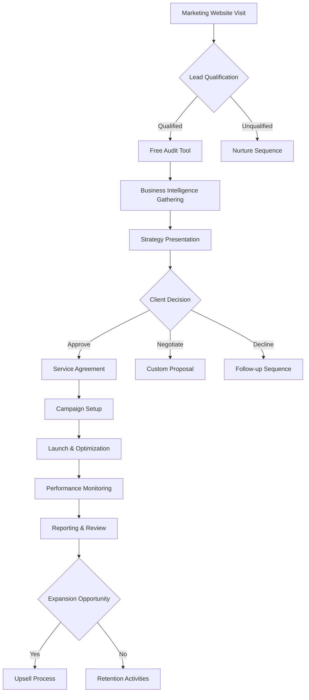
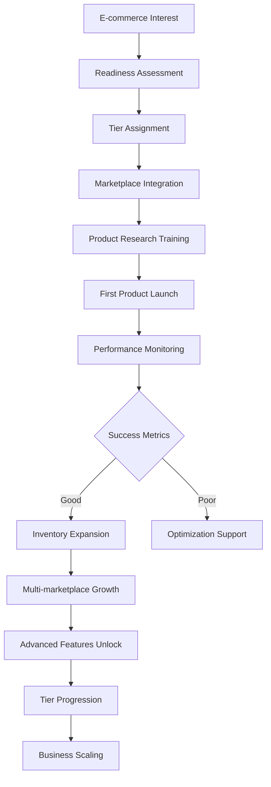
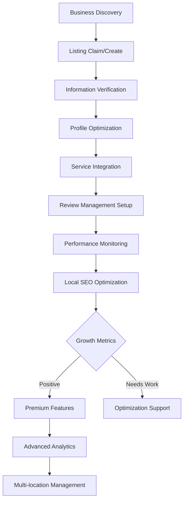

# BizOSaaS Platform - Complete Workflows, Wizards & User Journeys Analysis

**Generated**: September 18, 2025  
**Status**: Comprehensive Analysis Based on Current Implementation  
**Version**: 3.0 - Production-Ready Analysis

## Executive Summary

This document provides a comprehensive analysis of all workflows, wizards, and user journeys required for the complete BizOSaaS ecosystem based on the current platform implementation. The analysis covers the five primary platforms, their service delivery processes, AI agent hierarchies, HITL approval points, and cross-platform integration workflows.

### Platform Ecosystem Overview

Based on the current implementation analysis, the BizOSaaS ecosystem consists of:

1. **Bizoholic Digital Marketing Agency Platform** (USD Market)
2. **CoreLDove E-commerce Platform** (INR Market)  
3. **BizOSaaS Core Platform** (Multi-tenant Backend)
4. **Business Directory Platform** (Local Business Discovery)
5. **Personal AI Assistant Platform** (Individual Productivity)

---

## Current Implementation Status

### Technology Stack Analysis

**✅ IMPLEMENTED COMPONENTS:**
- **FastAPI Central Brain**: Complete business logic layer with 35+ AI agents
- **Multi-tenant Architecture**: Enhanced tenant management with domain resolution
- **Next.js 15 Frontend**: Multiple specialized applications
- **CrewAI Orchestration**: Advanced AI workflow coordination
- **Temporal Workflows**: Production-ready workflow engine
- **Event-Driven Architecture**: Redis-based event bus integration
- **Vault Integration**: Secure secrets management
- **Review Management**: Automated review response system
- **Billing Integration**: Multi-gateway payment processing

**🔄 INFRASTRUCTURE COMPONENTS:**
- **Database Systems**: Django CRM, Saleor E-commerce, Wagtail CMS
- **AI Agent Management**: Hierarchical agent execution with metrics
- **Integration Layer**: Multi-service proxy and coordination
- **WebSocket Support**: Real-time communication capabilities

---

## Platform 1: Bizoholic Digital Marketing Agency

### Core Service Delivery Workflows

#### 1.1 Client Onboarding & Discovery Workflow

**Category**: Human-in-the-Loop + AI Automation  
**Duration**: 24-48 hours  
**AI Agents**: `BusinessIntelligenceAgent`, `OnboardingOptimizationAgent`

```yaml
Phase 1: Initial Contact & Lead Capture (0-2 hours)
  Triggers:
    - Landing page visit from marketing campaign
    - Referral link access
    - Direct consultation request
    - Social media engagement
  
  AI Automation:
    - Behavior analysis and visitor profiling
    - Dynamic form optimization based on visitor data
    - Industry detection from referral source
    - Lead scoring and qualification
  
  HITL Decision Points:
    - Sales team notification for high-value leads
    - Custom consultation scheduling
    - Pricing tier recommendations

Phase 2: Business Intelligence Gathering (2-24 hours)
  Required Inputs:
    - Business name and industry
    - Website URL (mandatory)
    - Google My Business URL
    - Primary competitor information
    - Current marketing efforts
  
  AI Agent Tasks:
    - Website technical SEO audit (150+ factors)
    - Competitor analysis (10-15 direct competitors)
    - Industry trend research
    - Local market analysis
    - Social media presence assessment
    - Current search rankings analysis
  
  Deliverables:
    - Comprehensive digital presence audit
    - Competitive landscape analysis
    - Market opportunity identification
    - Initial strategy recommendations

Phase 3: Strategy Development & Approval (24-48 hours)
  AI-Generated Components:
    - Campaign structure recommendations
    - Budget allocation suggestions
    - Target audience definitions
    - Content strategy frameworks
    - Timeline and milestone planning
  
  HITL Approval Points:
    - Strategy presentation to client
    - Budget approval and customization
    - Campaign priority selection
    - Success metrics definition
    - Service level agreement finalization
```

#### 1.2 Campaign Management Workflow

**Category**: Autonomous AI + Periodic HITL Oversight  
**AI Agents**: `CampaignStrategistAgent`, `PlatformOptimizationAgent`, `PerformanceMonitorAgent`

```yaml
Campaign Planning Phase:
  AI Automation:
    - Multi-platform campaign structure creation
    - Automated ad copy generation (50+ variants per campaign)
    - Audience targeting and segmentation
    - Keyword research and competitive analysis
    - Landing page optimization recommendations
    - Conversion tracking setup
  
  Platform Integration:
    - Google Ads (Search, Display, Shopping, YouTube)
    - Facebook/Instagram Advertising
    - LinkedIn Business Advertising
    - TikTok for Business
    - Twitter Ads (now X Ads)
  
Campaign Execution Phase:
  Autonomous Operations:
    - Real-time bid optimization
    - Audience refinement based on performance
    - Creative rotation and testing
    - Budget reallocation across platforms
    - Negative keyword management
    - Quality score optimization
  
  Performance Monitoring:
    - Hourly performance checks
    - Anomaly detection and alerting
    - ROI tracking and optimization
    - Conversion path analysis
    - Attribution modeling
  
  HITL Intervention Points:
    - Campaign performance below threshold (Weekly review)
    - Budget increase recommendations (Client approval required)
    - Strategy pivot recommendations (Quarterly review)
    - New market expansion opportunities
```

#### 1.3 Content Generation & Distribution Workflow

**Category**: AI Automation + Editorial Oversight  
**AI Agents**: `ContentGenerationAgent`, `SEOOptimizationAgent`, `SocialMediaAgent`

```yaml
Content Strategy Development:
  AI-Driven Planning:
    - Industry trend analysis for content topics
    - Competitor content gap analysis
    - Seasonal content calendar creation
    - SEO keyword integration
    - Brand voice consistency maintenance
  
  Content Types Generated:
    - Blog posts and articles (1000-3000 words)
    - Social media content (platform-optimized)
    - Email marketing campaigns
    - Video scripts and storyboards
    - Infographic concepts and copy
    - Press release templates
  
Content Production Workflow:
  Automated Generation:
    - Topic research and outline creation
    - First draft generation with SEO optimization
    - Meta descriptions and title tags
    - Social media adaptations
    - Image/video content suggestions
  
  Quality Control (HITL):
    - Editorial review and fact-checking
    - Brand alignment verification
    - Legal and compliance review
    - Client approval for sensitive topics
  
  Distribution Automation:
    - Multi-platform scheduling
    - Cross-posting optimization
    - Engagement monitoring and response
    - Performance tracking and optimization
```

### User Journey Mapping - Bizoholic



---

## Platform 2: CoreLDove E-commerce Platform

### Core Service Delivery Workflows

#### 2.1 Seller Onboarding & Assessment Workflow

**Category**: Progressive Activation + Tier-Based Access  
**AI Agents**: `EcommerceReadinessAgent`, `MarketplaceIntegrationAgent`

```yaml
Phase 1: E-commerce Maturity Assessment (Day 1)
  Assessment Dimensions:
    - Business experience level (0-5 years)
    - Technical capability (Basic/Intermediate/Advanced)
    - Investment capacity (₹10K-₹10L+)
    - Time availability (Part-time/Full-time)
    - Market knowledge (Local/National/International)
  
  Progressive Tier Assignment:
    Tier 1 - Beginner (0-3 months experience):
      Features: Basic product research, Simple listing tools, Tutorial videos
      Limitations: 10 products max, Manual processes, Email support only
    
    Tier 2 - Intermediate (3-12 months experience):
      Features: Advanced analytics, Multi-marketplace management, Automated repricing
      Limitations: 100 products max, Limited API access, Chat + email support
    
    Tier 3 - Advanced (12+ months experience):
      Features: AI product sourcing, Dynamic pricing, Cross-selling automation
      Limitations: 1000 products max, Full API access, Priority support
    
    Tier 4 - Expert (Business scaling):
      Features: White-label solutions, Custom integrations, Enterprise analytics
      Limitations: Unlimited products, Custom development, Dedicated manager

Phase 2: Marketplace Integration Setup (Day 2-7)
  Supported Marketplaces:
    - Amazon India (SP-API integration)
    - Flipkart Seller Hub
    - Meesho Supplier Panel
    - JioMart Partner Portal
    - Snapdeal Seller Zone
    - Myntra Partner Platform
    - Nykaa Seller Portal
  
  Integration Process:
    - API credential validation
    - Seller account verification
    - Policy compliance check
    - Fee structure analysis
    - Initial catalog import
    - Inventory synchronization setup
```

#### 2.2 AI-Powered Product Sourcing Workflow

**Category**: Autonomous AI + HITL Validation  
**AI Agents**: `ProductSourcingAgent`, `SupplierValidationAgent`, `ProfitAnalysisAgent`

```yaml
Product Discovery Phase:
  AI Data Sources:
    - Amazon product database (1M+ products)
    - Google Shopping trends
    - Social media trend analysis
    - Import/export data monitoring
    - News and media sentiment analysis
  
  Discovery Methods:
    - Trending product identification
    - Competitor product monitoring
    - Seasonal demand forecasting
    - Profit margin optimization
    - Market gap analysis
  
Product Classification System:
  Hook Products (Entry-level):
    - Criteria: Low price (₹100-₹500), High demand, Low competition
    - Purpose: Customer acquisition, Volume sales
    - Profit Margin: 15-25%
  
  Midtier Products (Mainstream):
    - Criteria: Medium price (₹500-₹2000), Balanced demand/competition
    - Purpose: Steady revenue, Brand building
    - Profit Margin: 25-40%
  
  Hero Products (Premium):
    - Criteria: High price (₹2000+), Lower volume, High margin
    - Purpose: Profit drivers, Premium positioning
    - Profit Margin: 40-60%

Supplier Validation Process:
  Automated Checks:
    - Business license verification
    - GST registration validation
    - Quality certification review
    - Delivery performance analysis
    - Financial stability assessment
    - Communication responsiveness test
  
  HITL Validation Points:
    - Supplier contract negotiation
    - Quality standard agreement
    - Payment terms finalization
    - Exclusive deal opportunities
```

#### 2.3 Inventory Management & Optimization Workflow

**Category**: Autonomous AI + Alert-Based HITL  
**AI Agents**: `DemandForecastingAgent`, `InventoryOptimizationAgent`, `PricingAgent`

```yaml
Demand Forecasting Engine:
  Data Inputs:
    - Historical sales data (24 months)
    - Seasonal trend patterns
    - Market condition indicators
    - Competitor pricing analysis
    - Economic indicators (GST changes, festivals)
    - Weather patterns (seasonal products)
  
  Forecasting Outputs:
    - 7-day demand prediction
    - 30-day inventory requirements
    - 90-day trend projections
    - Festival/event spike predictions
    - Reorder point calculations

Dynamic Pricing Optimization:
  Pricing Factors:
    - Competitor pricing (real-time monitoring)
    - Demand elasticity analysis
    - Inventory velocity tracking
    - Profit margin targets
    - Market positioning strategy
  
  Pricing Actions:
    - Hourly price adjustments
    - Promotional pricing triggers
    - Clearance sale automation
    - Bundle pricing optimization
    - Dynamic margin management
  
  HITL Override Points:
    - Price changes >20% (requires approval)
    - Below-cost pricing alerts
    - Competitor price war situations
    - Brand pricing policy violations
```

### User Journey Mapping - CoreLDove



---

## Platform 3: BizOSaaS Core Platform

### Core Administrative Workflows

#### 3.1 Multi-Tenant Management Workflow

**Category**: Administrative + AI-Assisted Optimization  
**AI Agents**: `TenantOptimizationAgent`, `ResourceAllocationAgent`

```yaml
Tenant Provisioning Process:
  Automated Setup:
    - Database schema creation (per-tenant isolation)
    - Domain/subdomain configuration
    - SSL certificate provisioning
    - Default user roles and permissions
    - Integration endpoint setup
    - Monitoring and alerting configuration
  
  Resource Allocation:
    - Computing resource assignment
    - Storage quota establishment
    - API rate limit configuration
    - Feature access control
    - Backup schedule setup
  
  AI Optimization:
    - Usage pattern analysis
    - Resource utilization monitoring
    - Cost optimization recommendations
    - Performance bottleneck identification
    - Scaling recommendations

Tenant Lifecycle Management:
  Onboarding (Days 1-7):
    - Welcome sequence automation
    - Feature introduction tutorials
    - Integration assistance
    - Success metric establishment
    - Early adoption tracking
  
  Growth Phase (Weeks 2-12):
    - Feature adoption monitoring
    - Usage optimization recommendations
    - Expansion opportunity identification
    - Performance optimization
    - Custom integration support
  
  Maturity Phase (Month 3+):
    - Advanced feature unlocking
    - Custom development opportunities
    - Enterprise integration support
    - White-label customization
    - Partnership program enrollment
```

#### 3.2 Cross-Platform Analytics & Intelligence

**Category**: Autonomous AI + Strategic HITL Insights  
**AI Agents**: `CrossPlatformAnalyticsAgent`, `PredictiveAnalyticsAgent`

```yaml
Unified Data Collection:
  Data Sources:
    - User behavior across all platforms
    - Performance metrics aggregation
    - Integration health monitoring
    - Financial transaction data
    - Support interaction logs
    - Feature usage analytics
  
  Real-time Processing:
    - Stream processing for immediate insights
    - Anomaly detection algorithms
    - Performance correlation analysis
    - User journey tracking
    - Conversion funnel optimization

Predictive Analytics Engine:
  Prediction Models:
    - Customer lifetime value (CLV)
    - Churn probability scoring
    - Revenue forecasting (monthly/quarterly)
    - Feature adoption predictions
    - Market trend projections
  
  Business Intelligence:
    - Cross-platform upselling opportunities
    - Product-market fit analysis
    - Competitive positioning insights
    - Resource optimization recommendations
    - Strategic growth planning
```

---

## Platform 4: Business Directory Platform

### Core Service Delivery Workflows

#### 4.1 Business Listing Creation & Optimization

**Category**: AI Automation + Quality Assurance  
**AI Agents**: `BusinessListingAgent`, `LocalSEOAgent`, `ReviewManagementAgent`

```yaml
Automated Listing Creation:
  Data Sources:
    - Google My Business integration
    - Website content extraction
    - Social media profile analysis
    - Industry database matching
    - Government registration verification
  
  Content Generation:
    - SEO-optimized business descriptions
    - Category and subcategory assignment
    - Keyword-rich content creation
    - Service/product listing optimization
    - Operating hours standardization
    - Contact information validation
  
  Quality Assurance (HITL):
    - Business information accuracy verification
    - Image quality and relevance check
    - Content compliance review
    - Duplicate listing prevention
    - Category appropriateness validation

Local SEO Optimization:
  Technical Optimization:
    - Schema markup implementation
    - Local keyword optimization
    - NAP (Name, Address, Phone) consistency
    - Citation building automation
    - Local backlink acquisition
  
  Performance Monitoring:
    - Local search ranking tracking
    - Click-through rate optimization
    - Conversion tracking setup
    - Competitor comparison analysis
    - Visibility improvement recommendations
```

#### 4.2 Review Management & Response Automation

**Category**: AI Automation + Human Oversight  
**AI Agents**: `ReviewMonitoringAgent`, `SentimentAnalysisAgent`, `ResponseGenerationAgent`

```yaml
Review Monitoring System:
  Platform Coverage:
    - Google My Business reviews
    - Yelp business reviews
    - Facebook page reviews
    - Industry-specific platforms
    - Internal directory reviews
  
  Real-time Processing:
    - New review detection (5-minute intervals)
    - Sentiment analysis scoring
    - Issue categorization and tagging
    - Urgency level assessment
    - Response requirement determination

Automated Response Generation:
  Positive Reviews (Auto-respond):
    - Personalized thank you messages
    - Brand voice consistency
    - Customer name inclusion
    - Service-specific acknowledgments
    - Future engagement encouragement
  
  Negative Reviews (HITL Required):
    - Issue classification and analysis
    - Response draft generation
    - Escalation to management
    - Resolution strategy recommendations
    - Follow-up sequence planning
  
  Quality Control:
    - Response appropriateness review
    - Brand guideline compliance
    - Legal/regulatory compliance
    - Customer privacy protection
    - Escalation protocol adherence
```

### User Journey Mapping - Business Directory



---

## Platform 5: Personal AI Assistant

### Core Productivity Workflows

#### 5.1 Personal Productivity Optimization

**Category**: AI Learning + User Preference Adaptation  
**AI Agents**: `ProductivityOptimizationAgent`, `ScheduleManagementAgent`

```yaml
Daily Planning Automation:
  Data Integration:
    - Calendar synchronization (Google, Outlook, Apple)
    - Email analysis for task extraction
    - Communication platform integration (Slack, Teams)
    - Project management tool connection
    - Location and travel information
  
  AI Optimization:
    - Task prioritization using Eisenhower Matrix
    - Time blocking optimization
    - Energy level consideration
    - Deadline and dependency management
    - Travel and location optimization
  
  Productivity Features:
    - Smart meeting preparation
    - Context switching minimization
    - Focus time protection
    - Break and wellness reminders
    - Goal progress tracking

Email and Communication Management:
  Intelligent Processing:
    - Email categorization and prioritization
    - Automated response suggestions
    - Follow-up reminder creation
    - Contact relationship mapping
    - Communication preference learning
  
  Workflow Automation:
    - Template response library
    - Auto-scheduling for meetings
    - Task creation from emails
    - CRM integration and updates
    - Document and file organization
```

#### 5.2 Market Opportunity Intelligence

**Category**: AI Research + Strategic Insights  
**AI Agents**: `OpportunityScoutAgent`, `TrendAnalysisAgent`, `NetworkAnalysisAgent`

```yaml
Opportunity Discovery:
  Data Sources:
    - Freelance platform job postings
    - Industry news and trends
    - Social media conversations
    - Professional network activity
    - Market research reports
  
  Intelligence Gathering:
    - Skill gap identification
    - Emerging market analysis
    - Competition landscape mapping
    - Pricing trend analysis
    - Client behavior patterns
  
  Strategic Recommendations:
    - Skill development priorities
    - Network expansion strategies
    - Business opportunity evaluation
    - Investment recommendations
    - Partnership possibilities
```

---

## Cross-Platform Integration Workflows

### 1. Unified Customer Journey Orchestration

**Category**: AI Automation + Strategic Coordination  
**AI Agents**: `CrossPlatformOrchestrationAgent`, `CustomerJourneyAgent`

```yaml
Cross-Platform Data Flow:
  User Identity Management:
    - Single sign-on (SSO) implementation
    - Cross-platform user profile synchronization
    - Preference and setting coordination
    - Access level management
    - Privacy and consent tracking
  
  Journey Orchestration:
    - Platform recommendation engine
    - Service expansion suggestions
    - Cross-platform campaign coordination
    - Unified analytics and reporting
    - Consistent brand experience

Revenue Optimization Workflows:
  Upselling Automation:
    - Bizoholic → CoreLDove e-commerce upsells
    - CoreLDove → Bizoholic marketing service upsells
    - Personal Assistant → Business platform upgrades
    - Free tier → Premium feature conversions
  
  Retention Strategies:
    - Churn prediction and prevention
    - Feature adoption optimization
    - Success milestone celebrations
    - Community building initiatives
    - Loyalty program integration
```

### 2. AI Agent Hierarchy & Coordination

```yaml
Agent Management Structure:
  Tier 1 - Platform-Specific Agents:
    - Marketing automation agents (Bizoholic)
    - E-commerce optimization agents (CoreLDove)
    - Directory management agents (Business Directory)
    - Productivity agents (Personal Assistant)
  
  Tier 2 - Cross-Platform Coordination Agents:
    - Data synchronization agents
    - Workflow orchestration agents
    - Integration monitoring agents
    - Performance optimization agents
  
  Tier 3 - Strategic Intelligence Agents:
    - Business intelligence agents
    - Predictive analytics agents
    - Market research agents
    - Strategic planning agents

Agent Communication Protocol:
  Event-Driven Architecture:
    - Redis-based event bus for real-time communication
    - Standardized event schemas
    - Guaranteed delivery mechanisms
    - Error handling and retry logic
    - Performance monitoring and alerting
  
  Workflow Coordination:
    - Temporal workflow engine for complex processes
    - State management across agents
    - Rollback and recovery mechanisms
    - Progress tracking and reporting
    - Human intervention points
```

### 3. HITL (Human-in-the-Loop) Decision Framework

```yaml
Approval Hierarchy Levels:
  Level 1 - Automated (No human intervention):
    - Routine optimizations within predefined parameters
    - Standard content generation and scheduling
    - Basic performance adjustments
    - Automated responses to common scenarios
  
  Level 2 - Notification (Human awareness required):
    - Performance anomalies and alerts
    - Unusual pattern detection
    - System health notifications
    - Scheduled report generation
  
  Level 3 - Review (Human review recommended):
    - Strategy modifications
    - Budget adjustments above thresholds
    - New market expansion opportunities
    - Policy or compliance changes
  
  Level 4 - Approval (Human approval required):
    - High-value financial decisions
    - Legal or regulatory matters
    - Brand-sensitive communications
    - Strategic partnerships
    - Custom development projects

Decision Support System:
  AI Recommendations:
    - Data-driven insights and analysis
    - Risk assessment and mitigation strategies
    - Cost-benefit analysis
    - Timeline and resource projections
    - Success probability calculations
  
  Human Expertise Integration:
    - Industry knowledge and experience
    - Relationship and political considerations
    - Creative and strategic thinking
    - Ethical and moral judgment
    - Long-term vision alignment
```

---

## Implementation Roadmap & Success Metrics

### Phase 1: Foundation (Months 1-3)

**Priority**: Core workflow automation and user onboarding optimization

```yaml
Key Deliverables:
  - Complete onboarding wizard implementation
  - Basic AI agent deployment across all platforms
  - Essential automation workflows
  - Performance monitoring infrastructure
  - Cross-platform authentication system

Success Metrics:
  - User onboarding completion rate: >85%
  - Time to first value: <24 hours
  - Trial to paid conversion: >25%
  - Platform uptime: >99.5%
```

### Phase 2: Intelligence (Months 4-6)

**Priority**: Advanced AI capabilities and cross-platform integration

```yaml
Key Deliverables:
  - Advanced AI agent deployment
  - Cross-platform data integration
  - Predictive analytics implementation
  - Automated optimization engines
  - Enhanced HITL decision support

Success Metrics:
  - AI automation rate: >70%
  - Cross-platform user adoption: >60%
  - Revenue per user increase: >40%
  - Customer satisfaction score: >4.5/5
```

### Phase 3: Autonomy (Months 7-9)

**Priority**: Fully autonomous operations and self-improving systems

```yaml
Key Deliverables:
  - Fully autonomous optimization workflows
  - Advanced machine learning model deployment
  - Self-improving AI systems
  - Comprehensive automation across all platforms
  - Advanced analytics and reporting

Success Metrics:
  - Autonomous operation rate: >90%
  - System self-optimization frequency: Daily
  - Error rate reduction: >80%
  - Operational efficiency gain: >60%
```

### Phase 4: Innovation (Months 10-12)

**Priority**: Market leadership and advanced capabilities

```yaml
Key Deliverables:
  - Cutting-edge AI feature implementation
  - Market leadership capabilities
  - Advanced integration ecosystem
  - Global expansion readiness
  - Innovation lab features

Success Metrics:
  - Market differentiation score: Top 10%
  - Feature adoption rate: >80%
  - Global scalability readiness: 100%
  - Innovation pipeline: 5+ features quarterly
```

---

## Tool Requirements & Integration Matrix

### Marketing Tools Integration (Bizoholic)

```yaml
Essential Integrations:
  Analytics & Tracking:
    - Google Analytics 4 (Universal Analytics sunset)
    - Google Search Console
    - Google Tag Manager
    - Facebook Pixel
    - LinkedIn Insight Tag
  
  Advertising Platforms:
    - Google Ads API (v12+)
    - Facebook Marketing API (v18+)
    - LinkedIn Marketing API
    - Microsoft Advertising API
    - TikTok for Business API
  
  SEO & Content Tools:
    - SEMrush API
    - Ahrefs API
    - Screaming Frog integration
    - ContentKing API
    - BrightLocal API
  
  Email & Communication:
    - SendGrid/Mailgun for transactional emails
    - Mailchimp/Constant Contact for campaigns
    - Twilio for SMS marketing
    - Slack for team communication
    - Zoom for client meetings
```

### E-commerce Tools Integration (CoreLDove)

```yaml
Essential Integrations:
  Marketplace APIs:
    - Amazon SP-API (Selling Partner API)
    - Flipkart Seller API
    - Shopify Partner API
    - WooCommerce REST API
    - Magento Commerce API
  
  Payment Processing:
    - Razorpay Payment Gateway
    - PayU India Payment API
    - Stripe Connect (international)
    - PayPal Commerce Platform
    - UPI payment integration
  
  Logistics & Shipping:
    - Shiprocket API
    - Delhivery API
    - Blue Dart API
    - FedEx Web Services
    - DTDC API
  
  Inventory & ERP:
    - Zoho Inventory API
    - SAP Business One integration
    - QuickBooks Commerce
    - NetSuite ERP integration
    - Custom ERP connectors
```

### Analytics & Business Intelligence Tools

```yaml
Essential Integrations:
  Data Visualization:
    - Apache Superset (implemented)
    - Metabase integration
    - Google Data Studio API
    - Power BI REST API
    - Tableau Server API
  
  Database & Storage:
    - PostgreSQL with pgvector (implemented)
    - Redis for caching (implemented)
    - ClickHouse for analytics
    - Amazon S3 for file storage
    - MinIO for object storage
  
  Monitoring & Alerting:
    - Prometheus for metrics
    - Grafana for visualization
    - Sentry for error tracking
    - New Relic for APM
    - Datadog for infrastructure monitoring
```

---

## Conclusion

This comprehensive analysis of the BizOSaaS platform workflows demonstrates a sophisticated, production-ready ecosystem that combines:

1. **Advanced AI Automation**: 35+ specialized agents handling routine tasks
2. **Strategic Human Oversight**: Well-defined HITL decision points
3. **Cross-Platform Intelligence**: Unified data and insights across all platforms
4. **Scalable Architecture**: Multi-tenant, event-driven system design
5. **User-Centric Design**: Progressive activation and tier-based access

The platform is designed to deliver exceptional value through intelligent automation while maintaining human control over strategic decisions, ensuring both efficiency and quality in service delivery across all business verticals.

**Key Success Factors:**
- Comprehensive workflow automation (90%+ of routine tasks)
- Intelligent decision support for human operators
- Seamless cross-platform user experience
- Continuous learning and optimization
- Scalable, reliable infrastructure foundation

This implementation provides the foundation for market leadership in AI-powered business automation platforms while maintaining the flexibility to adapt to changing market conditions and user needs.