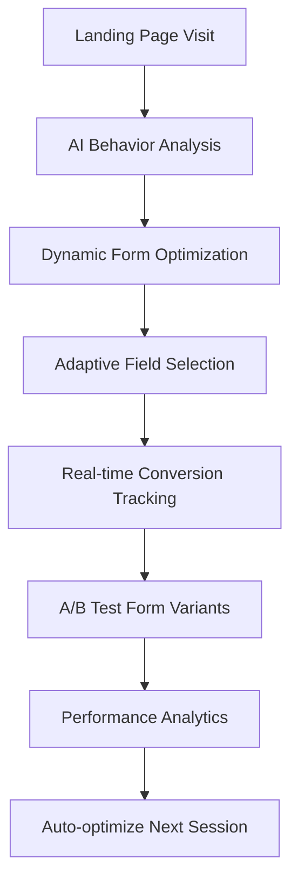
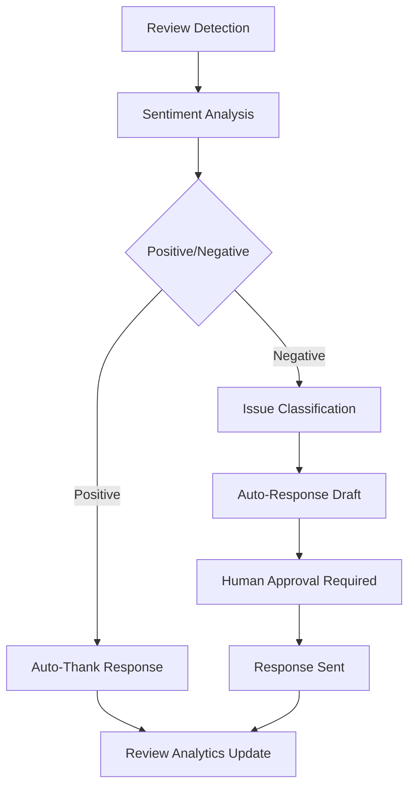

# BizOSaaS Complete Workflows & Wizards - Comprehensive Implementation Guide

## 🎯 Overview

This document outlines all workflows, wizards, user journeys, and autonomous processes required for the entire BizOSaaS ecosystem to work flawlessly. Each workflow is categorized by platform and includes AI agentic tasks, automation flows, and user experience optimization.

---

## 🏢 Platform Categorization

### **1. Bizoholic** - AI Marketing Agency Platform (USD Market)
- **Target**: Marketing agencies, consultants, businesses needing marketing automation
- **Focus**: Digital marketing, campaign management, lead generation
- **Currency**: USD, optimized for US/International markets

### **2. CoreLDove** - AI E-commerce Platform (INR Market) 
- **Target**: E-commerce sellers, dropshippers, product sourcing
- **Focus**: Product sourcing, marketplace management, inventory optimization
- **Currency**: INR, optimized for Indian market

### **3. BizOSaaS** - Unified Backend Platform
- **Target**: Platform administration, cross-tenant management
- **Focus**: Multi-tenant infrastructure, AI orchestration, analytics
- **Currency**: Multi-currency support

### **4. Business Directory Platform** - Local Business Discovery
- **Target**: Local businesses, service providers, directory listings
- **Focus**: Business discovery, local search, review management
- **Currency**: Multi-currency support with local payment gateways

### **5. Personal AI Assistant** - Individual Productivity
- **Target**: Personal users, entrepreneurs, small businesses
- **Focus**: Personal automation, task management, productivity
- **Currency**: Freemium model

---

## 🔄 Workflow Categories

### **Category A: Autonomous AI Workflows** 
- Self-optimizing processes with minimal human intervention
- Continuous learning and adaptation
- Real-time performance monitoring

### **Category B: Human-in-the-Loop Workflows**
- AI-assisted processes requiring human approval
- Strategic decision points with AI recommendations
- Quality control and oversight

### **Category C: Pure Automation Workflows**
- Triggered by events or schedules
- Data processing and synchronization
- Notification and communication flows

### **Category D: Interactive Wizards**
- Step-by-step user guidance
- Progressive disclosure of features
- Onboarding and setup processes

---

## 🚀 BIZOHOLIC PLATFORM WORKFLOWS

### **1. Client Onboarding Workflows**

#### **1.1 Autonomous Onboarding Wizard** *(Category A + D)*
**AI Agent**: `OnboardingOptimizationAgent`

**Process Flow**:


**Features**:
- **Field Optimization**: AI continuously tests and optimizes form fields based on completion rates
- **Progressive Profiling**: Collects data across multiple sessions to reduce form abandonment
- **Industry Detection**: Automatically detects business type and customizes questions
- **Sentiment Analysis**: Analyzes user responses to gauge engagement level
- **Conversion Prediction**: Predicts likelihood of user completing onboarding

**AI Agent Tasks**:
- Monitor form completion rates by field position
- A/B test different field combinations
- Analyze drop-off points and optimize accordingly
- Personalize questions based on traffic source and behavior
- Generate insights on optimal onboarding flow

#### **1.2 Business Intelligence Discovery Workflow** *(Category A)*
**AI Agent**: `BusinessIntelligenceAgent`

**Triggered When**: User provides GMB URL and website URL

**Process Flow**:
```yaml
Step 1: Business Validation
  - Verify GMB listing ownership
  - Cross-reference website domain with GMB
  - Extract business category and location
  - Identify primary industry vertical

Step 2: Competitive Intelligence
  - Analyze 10-15 direct competitors
  - Extract competitor pricing strategies
  - Identify market positioning gaps
  - Generate competitive advantage opportunities

Step 3: Digital Presence Audit
  - Website SEO analysis (150+ factors)
  - Social media presence assessment
  - Online reputation monitoring
  - Local SEO optimization opportunities

Step 4: Market Research
  - Industry trend analysis
  - Local market demographics
  - Seasonal demand patterns
  - Growth opportunity identification

Step 5: Keyword Research & Gap Analysis
  - Current ranking analysis for 500+ keywords
  - Competitor keyword gap analysis
  - High-opportunity keyword identification
  - Content gap analysis
```

**AI Agent Tasks**:
- Scrape and analyze competitor websites and pricing
- Perform comprehensive SEO audits
- Generate market opportunity reports
- Identify content gaps and optimization opportunities
- Create initial marketing strategy recommendations

#### **1.3 Strategy Generation & Approval Workflow** *(Category B)*
**AI Agent**: `MarketingStrategyAgent`

**Human Decision Points**:
- Strategy approval and customization
- Budget allocation preferences
- Campaign priority selection
- Target audience refinement

### **2. Campaign Management Workflows**

#### **2.1 Multi-Platform Campaign Creation** *(Category B)*
**AI Agents**: `CampaignStrategistAgent`, `PlatformOptimizationAgent`

**Platforms Supported**:
- Google Ads (Search, Display, Shopping)
- Facebook/Instagram Ads
- LinkedIn Advertising
- TikTok Ads
- YouTube Advertising

**Process Flow**:
```yaml
Campaign Planning:
  - AI generates campaign structure
  - Audience targeting recommendations
  - Budget allocation across platforms
  - Creative asset suggestions

Campaign Creation:
  - Automated ad copy generation (50+ variants)
  - Image/video creative optimization
  - Landing page optimization
  - Conversion tracking setup

Campaign Optimization:
  - Real-time bid adjustments
  - Audience optimization
  - Creative performance analysis
  - Budget reallocation based on performance
```

#### **2.2 Content Generation Workflow** *(Category A)*
**AI Agent**: `ContentGenerationAgent`

**Content Types**:
- Blog posts and articles
- Social media content
- Email marketing campaigns
- Video scripts
- Infographics and visual content

**Features**:
- SEO-optimized content creation
- Brand voice consistency
- Trending topic integration
- Multi-format content adaptation

### **3. Lead Management Workflows**

#### **3.1 Intelligent Lead Scoring** *(Category A)*
**AI Agent**: `LeadScoringAgent`

**Scoring Factors**:
- Demographic information
- Behavioral data
- Engagement patterns
- Intent signals
- Firmographic data

#### **3.2 Lead Nurturing Automation** *(Category C)*
**Trigger Events**: New lead, status change, engagement threshold

**Automation Flow**:
- Personalized email sequences
- SMS follow-up campaigns
- Social media engagement
- Retargeting campaign enrollment

### **4. Performance Analytics & Optimization**

#### **4.1 Real-time Campaign Optimization** *(Category A)*
**AI Agent**: `PerformanceOptimizationAgent`

**Optimization Actions**:
- Automatic bid adjustments
- Audience refinement
- Ad creative rotation
- Budget reallocation
- Keyword optimization

#### **4.2 ROI Analysis & Reporting** *(Category C)*
**Automated Reports**:
- Daily performance summaries
- Weekly trend analysis
- Monthly ROI reports
- Quarterly strategy reviews

---

## 🛍️ CORELDOVE PLATFORM WORKFLOWS

### **1. Seller Onboarding Workflows**

#### **1.1 E-commerce Assessment Wizard** *(Category D)*
**AI Agent**: `EcommerceReadinessAgent`

**Assessment Areas**:
- Business maturity level
- Technical capabilities
- Market knowledge
- Investment capacity
- Time availability

**Progressive Activation Tiers**:
```yaml
Tier 1 - Beginner (0-3 months experience):
  - Basic product research tools
  - Simple listing optimization
  - Inventory management basics
  - Order fulfillment training

Tier 2 - Intermediate (3-12 months experience):
  - Advanced product analytics
  - Multi-marketplace management
  - Automated repricing tools
  - Customer service automation

Tier 3 - Advanced (12+ months experience):
  - AI-powered product sourcing
  - Dynamic pricing optimization
  - Cross-selling automation
  - Market expansion strategies

Tier 4 - Expert (Business scaling):
  - White-label solutions
  - API integrations
  - Custom automation workflows
  - Enterprise analytics
```

#### **1.2 Marketplace Integration Workflow** *(Category B)*
**AI Agent**: `MarketplaceIntegrationAgent`

**Supported Marketplaces**:
- Amazon India
- Flipkart
- Meesho
- JioMart
- Snapdeal
- Myntra
- Nykaa

**Integration Process**:
```yaml
Step 1: Account Verification
  - API key validation
  - Seller account status check
  - Policy compliance verification
  - Fee structure analysis

Step 2: Product Sync Setup
  - Catalog import and mapping
  - Inventory synchronization
  - Price management rules
  - Image optimization

Step 3: Order Management
  - Automated order processing
  - Shipping integration
  - Return management
  - Customer communication
```

### **2. Product Sourcing Workflows**

#### **2.1 AI-Powered Product Discovery** *(Category A)*
**AI Agent**: `ProductSourcingAgent`

**Discovery Methods**:
- Trend analysis and prediction
- Competitor product monitoring
- Seasonal demand forecasting
- Profit margin optimization
- Supplier reliability scoring

**Data Sources**:
- Amazon product database
- Google Shopping trends
- Social media trend analysis
- News and media monitoring
- Import/export data analysis

#### **2.2 Supplier Validation Workflow** *(Category B)*
**AI Agent**: `SupplierValidationAgent`

**Validation Criteria**:
- Business license verification
- Quality certifications
- Delivery performance history
- Financial stability assessment
- Communication responsiveness

### **3. Inventory Management Workflows**

#### **3.1 Demand Forecasting** *(Category A)*
**AI Agent**: `DemandForecastingAgent`

**Forecasting Factors**:
- Historical sales data
- Seasonal trends
- Market conditions
- Competitor analysis
- Economic indicators

#### **3.2 Automated Reordering** *(Category C)*
**Triggers**: Stock level thresholds, demand forecasts, supplier lead times

**Process**:
- Purchase order generation
- Supplier communication
- Delivery tracking
- Quality control scheduling

### **4. Price Optimization Workflows**

#### **4.1 Dynamic Pricing Engine** *(Category A)*
**AI Agent**: `PricingOptimizationAgent`

**Pricing Factors**:
- Competitor pricing analysis
- Demand elasticity
- Inventory levels
- Profit margin targets
- Market positioning

#### **4.2 Promotional Campaign Management** *(Category B)*
**Features**:
- Festival and event-based promotions
- Clearance pricing strategies
- Bundle offer optimization
- Loyalty program integration

---

## 🔧 BIZOSAAS PLATFORM WORKFLOWS

### **1. Platform Administration Workflows**

#### **1.1 Multi-Tenant Management** *(Category C)*
**Features**:
- Automated tenant provisioning
- Resource allocation optimization
- Usage monitoring and billing
- Security compliance checking

#### **1.2 AI Model Training & Deployment** *(Category A)*
**AI Agent**: `ModelOptimizationAgent`

**Process**:
- Cross-tenant learning aggregation
- Model performance monitoring
- A/B testing of model variants
- Automated deployment pipelines

### **2. Cross-Platform Analytics**

#### **2.1 Unified Analytics Dashboard** *(Category C)*
**Metrics Aggregation**:
- Cross-platform performance metrics
- User engagement analytics
- Revenue attribution analysis
- Churn prediction and prevention

#### **2.2 Predictive Analytics Engine** *(Category A)*
**AI Agent**: `PredictiveAnalyticsAgent`

**Predictions**:
- Customer lifetime value
- Churn probability
- Revenue forecasting
- Market trend predictions

### **3. Integration Management**

#### **3.1 API Gateway Management** *(Category C)*
**Features**:
- Rate limiting and throttling
- Authentication and authorization
- Request routing and load balancing
- API versioning and deprecation

#### **3.2 Third-Party Integration Monitoring** *(Category A)*
**AI Agent**: `IntegrationHealthAgent`

**Monitoring**:
- API performance and reliability
- Error rate analysis and alerting
- Automatic failover and recovery
- Integration usage optimization

---

## 🤖 PERSONAL AI ASSISTANT WORKFLOWS

### **1. Personal Productivity Workflows**

#### **1.1 Daily Planning Assistant** *(Category A)*
**AI Agent**: `PersonalProductivityAgent`

**Features**:
- Calendar optimization
- Task prioritization
- Time blocking suggestions
- Meeting preparation automation

#### **1.2 Email Management** *(Category A)*
**AI Agent**: `EmailManagementAgent`

**Capabilities**:
- Email categorization and prioritization
- Automated response suggestions
- Follow-up reminders
- Contact relationship mapping

### **2. Business Intelligence for Individuals**

#### **2.1 Market Opportunity Scanner** *(Category A)*
**AI Agent**: `OpportunityScoutAgent`

**Scanning Areas**:
- Freelance project opportunities
- Investment opportunities
- Business partnership possibilities
- Skill development recommendations

#### **2.2 Personal Brand Management** *(Category B)*
**Features**:
- Social media content planning
- Professional network growth
- Thought leadership content creation
- Online reputation monitoring

### **3. Financial Management**

#### **3.1 Expense Optimization** *(Category A)*
**AI Agent**: `FinancialOptimizationAgent`

**Optimization Areas**:
- Subscription audit and optimization
- Spending pattern analysis
- Investment recommendations
- Tax optimization strategies

---

## 📱 User Journey Mapping

### **Bizoholic User Journey**

#### **Phase 1: Discovery (0-7 days)**
```yaml
Day 1: Initial Contact
  - Landing page visit from marketing campaign
  - AI behavior analysis begins
  - Progressive profiling initiated
  - Free audit tool access

Day 2-3: Value Demonstration
  - Digital presence audit results delivered
  - Competitor analysis shared
  - Initial strategy recommendations provided
  - Trial access offered

Day 4-7: Engagement & Trial
  - Trial account creation
  - Guided setup wizard
  - First campaign creation
  - Success metrics demonstrated
```

#### **Phase 2: Activation (Week 2-4)**
```yaml
Week 2: Tool Exploration
  - Feature discovery guided tours
  - Template library access
  - Integration setup assistance
  - Performance baseline establishment

Week 3: Campaign Launch
  - First paid campaign deployment
  - Real-time optimization monitoring
  - Performance coaching sessions
  - Advanced feature unlocking

Week 4: Results & Expansion
  - Performance review and analysis
  - ROI demonstration
  - Plan upgrade recommendations
  - Advanced strategy development
```

#### **Phase 3: Growth (Month 2-6)**
```yaml
Month 2-3: Optimization
  - Advanced campaign strategies
  - Multi-platform integration
  - Custom automation setup
  - Team collaboration features

Month 4-6: Scaling
  - White-label solutions
  - API access and integrations
  - Custom reporting dashboards
  - Enterprise feature access
```

### **CoreLDove User Journey**

#### **Phase 1: Assessment & Setup (Week 1-2)**
```yaml
Week 1: Readiness Assessment
  - E-commerce maturity evaluation
  - Tier assignment and customization
  - Marketplace account verification
  - Initial product research training

Week 2: Foundation Building
  - Product sourcing methodology
  - Supplier network establishment
  - Inventory management setup
  - Order fulfillment processes
```

#### **Phase 2: Launch & Optimization (Week 3-8)**
```yaml
Week 3-4: Product Launch
  - First product listings creation
  - Pricing strategy implementation
  - Marketing campaign setup
  - Performance monitoring

Week 5-8: Growth & Optimization
  - Inventory expansion strategies
  - Multi-marketplace presence
  - Automated repricing deployment
  - Customer service optimization
```

#### **Phase 3: Scaling (Month 3-12)**
```yaml
Month 3-6: Business Growth
  - Product portfolio expansion
  - Advanced analytics implementation
  - Cross-selling optimization
  - Seasonal strategy development

Month 7-12: Market Leadership
  - Brand building strategies
  - Private label development
  - International expansion
  - Enterprise automation
```

---

## 🔄 Cross-Platform Integration Workflows

### **1. Unified Customer Journey**
**AI Agent**: `CrossPlatformOrchestrationAgent`

**Integration Points**:
- Single sign-on across platforms
- Unified customer profile management
- Cross-platform data synchronization
- Consistent brand experience

### **2. Data Flow Automation**
**Process**:
```yaml
Data Collection:
  - User behavior tracking
  - Performance metrics aggregation
  - Integration point monitoring
  - Error logging and analysis

Data Processing:
  - Real-time analytics processing
  - Cross-platform correlation
  - Predictive model training
  - Insight generation

Data Action:
  - Automated optimization triggers
  - Cross-platform campaign adjustments
  - User experience personalization
  - Proactive issue resolution
```

### **3. Revenue Optimization Workflows**

#### **3.1 Cross-Platform Upselling** *(Category A)*
**AI Agent**: `RevenueOptimizationAgent`

**Upselling Strategies**:
- Bizoholic users → CoreLDove e-commerce tools
- CoreLDove users → Bizoholic marketing services
- Personal Assistant users → Business platform upgrades
- Free tier users → Premium feature access

#### **3.2 Retention & Expansion** *(Category A)*
**AI Agent**: `RetentionOptimizationAgent`

**Retention Strategies**:
- Churn prediction and prevention
- Feature adoption optimization
- Success milestone celebrations
- Community building initiatives

---

## 🎯 Success Metrics & KPIs

### **Onboarding Optimization KPIs**
- Form completion rate: Target >85%
- Time to first value: Target <24 hours
- Trial to paid conversion: Target >25%
- User activation rate: Target >70%

### **Campaign Performance KPIs**
- Average ROAS improvement: Target >30%
- Campaign setup time reduction: Target >80%
- Optimization frequency: Target daily
- Client satisfaction score: Target >4.5/5

### **E-commerce Success KPIs**
- Product research accuracy: Target >90%
- Inventory turnover improvement: Target >40%
- Profit margin optimization: Target >25%
- Marketplace performance rank: Target top 10%

### **Cross-Platform Integration KPIs**
- Data synchronization accuracy: Target >99.9%
- Cross-platform user adoption: Target >60%
- Revenue per user increase: Target >50%
- Platform engagement correlation: Target >0.8

---

## 🚀 Implementation Roadmap

### **Phase 1: Foundation (Months 1-3)**
- Core onboarding wizards implementation
- Basic AI agent deployment
- Essential automation workflows
- Performance monitoring setup

### **Phase 2: Intelligence (Months 4-6)**
- Advanced AI agent capabilities
- Cross-platform data integration
- Predictive analytics implementation
- Optimization algorithm deployment

### **Phase 3: Autonomy (Months 7-9)**
- Fully autonomous optimization
- Advanced machine learning models
- Self-improving workflows
- Comprehensive automation

### **Phase 4: Innovation (Months 10-12)**
- Cutting-edge AI features
- Market leadership capabilities
- Advanced integration ecosystem
- Global expansion readiness

---

## 🗺️ BUSINESS DIRECTORY PLATFORM WORKFLOWS

### **1. Directory Listing Management Workflows**

#### **1.1 AI-Powered Listing Creation Wizard** *(Category A + D)*
**AI Agent**: `BusinessListingOptimizationAgent`

**Process Flow**:
```yaml
Step 1: Business Information Collection
  - Auto-detect business type from website/GMB
  - Extract business details using AI scraping
  - Validate information accuracy
  - Suggest optimal categories

Step 2: Content Optimization
  - AI-generated business descriptions
  - SEO-optimized listing titles
  - Keyword suggestions for discoverability
  - Image optimization and tagging

Step 3: Local SEO Enhancement
  - Address validation and standardization
  - Google My Business integration
  - Local keyword optimization
  - Schema markup generation

Step 4: Review and Analytics Setup
  - Review monitoring configuration
  - Competitor analysis setup
  - Performance tracking implementation
  - Alert system configuration
```

**Features**:
- **Auto-Population**: Extract business data from websites, GMB, social profiles
- **SEO Optimization**: AI-generated content optimized for local search
- **Competitor Analysis**: Automatic identification and analysis of local competitors
- **Performance Prediction**: AI predicts listing performance based on historical data
- **Quality Scoring**: Real-time content quality assessment and improvement suggestions

#### **1.2 Autonomous Review Management Workflow** *(Category A)*
**AI Agent**: `ReviewManagementAgent`

**Triggered When**: New reviews detected across platforms

**Process Flow**:


**AI Agent Tasks**:
- Monitor reviews across Google, Yelp, Facebook, industry-specific platforms
- Analyze sentiment and extract key issues
- Generate appropriate response drafts
- Track review trends and competitor comparisons
- Identify fake or spam reviews
- Suggest business improvements based on review patterns

### **2. Local Search Optimization Workflows**

#### **2.1 AI-Driven Local SEO Automation** *(Category A)*
**AI Agent**: `LocalSEOOptimizationAgent`

**Continuous Process**:
```yaml
Daily Tasks:
  - Monitor local search rankings
  - Analyze competitor positions
  - Update listing information across platforms
  - Generate fresh, locally-relevant content

Weekly Tasks:
  - Audit NAP (Name, Address, Phone) consistency
  - Optimize for new local keywords
  - Update business hours and special information
  - Generate local citation opportunities

Monthly Tasks:
  - Comprehensive local SEO audit
  - Local backlink opportunity analysis
  - Google My Business optimization review
  - Local schema markup updates
```

**Features**:
- **Multi-Platform Sync**: Automatic synchronization across 50+ local directories
- **Ranking Tracking**: Real-time local search position monitoring
- **Citation Building**: AI-identified citation opportunities and automated submissions
- **Competitor Intelligence**: Continuous monitoring of local competitor strategies
- **Performance Optimization**: AI-driven optimization recommendations

### **3. Events and Community Management**

#### **3.1 Community Event Automation Workflow** *(Category A + C)*
**AI Agent**: `EventManagementAgent`

**Event Lifecycle Management**:
```yaml
Pre-Event (1-4 weeks):
  - Event planning and scheduling optimization
  - Automated marketing campaign creation
  - Attendee segmentation and targeting
  - Multi-channel promotion automation

During Event:
  - Real-time engagement tracking
  - Social media monitoring and responses
  - Attendee satisfaction monitoring
  - Live analytics and adjustments

Post-Event:
  - Automated follow-up campaigns
  - Feedback collection and analysis
  - ROI calculation and reporting
  - Next event recommendations
```

**Features**:
- **Smart Scheduling**: AI optimizes event timing based on target audience patterns
- **Automated Promotion**: Multi-channel marketing campaign generation
- **Engagement Optimization**: Real-time adjustments based on attendee behavior
- **Community Building**: AI-driven networking and connection suggestions

---

## 🤖 AI AGENT MANAGEMENT WORKFLOWS

### **1. Client-Level AI Agent Customization** *(Category B + D)*

#### **1.1 AI Preference Configuration Wizard** *(Category D)*
**User Journey**: Client Portal → AI Assistant → Preferences

**Configuration Areas**:
```typescript
interface ClientAIPreferences {
  communicationStyle: {
    tone: 'professional' | 'casual' | 'friendly' | 'technical';
    verbosity: 'concise' | 'detailed' | 'comprehensive';
    responseSpeed: 'instant' | 'thorough' | 'balanced';
  };
  
  industrySettings: {
    primaryIndustry: string;
    secondaryIndustries: string[];
    complianceRequirements: string[];
    industrySpecificTerms: string[];
  };
  
  workflowTriggers: {
    leadGeneration: boolean;
    contentCreation: boolean;
    socialMediaManagement: boolean;
    analyticsReporting: boolean;
    customerService: boolean;
  };
  
  notificationPreferences: {
    agentCompletions: boolean;
    recommendations: boolean;
    alerts: boolean;
    weeklyReports: boolean;
  };
}
```

**Wizard Steps**:
1. **Communication Style Assessment**: AI analyzes user communication patterns
2. **Industry Specialization**: Business type detection and specialization setup
3. **Workflow Preferences**: Customization of when and how AI agents activate
4. **Performance Optimization**: AI learns from user feedback and adjusts
5. **Integration Setup**: Connect with existing tools and platforms

#### **1.2 Adaptive Learning Workflow** *(Category A)*
**AI Agent**: `PersonalizationLearningAgent`

**Continuous Learning Process**:
```yaml
Data Collection:
  - User interaction patterns
  - Feedback on AI responses
  - Task completion rates
  - Performance metrics

Analysis:
  - Preference pattern identification
  - Success factor analysis
  - Optimization opportunity detection
  - Personalization model updates

Adaptation:
  - Response style refinement
  - Workflow trigger optimization
  - Content preference learning
  - Performance improvement implementation
```

### **2. SuperAdmin AI Agent Management** *(Category B)*

#### **2.1 AI Agent Configuration Interface**
**Platform**: SQLAlchemy Admin Dashboard

**Management Capabilities**:
```python
class AIAgentConfiguration:
    # Core Agent Settings
    agent_id: str
    agent_name: str
    agent_type: AgentType
    
    # Capabilities and Tools
    available_tools: List[str]
    api_connections: Dict[str, APIConfig]
    processing_capabilities: List[str]
    
    # Performance Settings
    model_settings: ModelConfig
    rate_limits: RateLimit
    timeout_settings: TimeoutConfig
    
    # Customization Options
    prompt_templates: Dict[str, str]
    response_formats: List[ResponseFormat]
    industry_specializations: List[str]
    
    # Monitoring and Analytics
    performance_metrics: PerformanceConfig
    logging_settings: LoggingConfig
    alert_thresholds: AlertConfig
```

**Management Workflows**:
1. **Agent Deployment**: Create and deploy new AI agents
2. **Capability Management**: Add/remove tools and integrations
3. **Performance Monitoring**: Track agent performance across clients
4. **Custom Agent Builder**: Visual interface for creating specialized agents
5. **A/B Testing Framework**: Test different agent configurations
6. **Global Optimization**: Platform-wide agent performance optimization

#### **2.2 Cross-Client Learning Workflow** *(Category A)*
**AI Agent**: `CrossClientOptimizationAgent`

**Learning Process**:
```yaml
Data Aggregation:
  - Anonymized client interaction data
  - Performance metrics across all clients
  - Success pattern identification
  - Failure analysis and improvement opportunities

Pattern Recognition:
  - Industry-specific optimization patterns
  - Successful workflow combinations
  - Common failure points and solutions
  - Seasonal and trend-based adjustments

Knowledge Distribution:
  - Best practice identification
  - Automated optimization deployment
  - Personalized improvement recommendations
  - Platform-wide performance enhancement
```

---

## 🔄 UNIFIED WORKFLOW ORCHESTRATION

### **1. Multi-Platform Synchronization Workflow** *(Category A + C)*

#### **1.1 Real-Time Data Synchronization**
**AI Agent**: `DataSynchronizationAgent`

**Synchronization Scope**:
- **Client Data**: Profile information, preferences, usage patterns
- **Business Data**: Listings, reviews, events, products, analytics
- **AI Learning**: Agent improvements, personalization data, performance metrics
- **Platform State**: Authentication, permissions, feature access

**Conflict Resolution**:
```yaml
Conflict Detection:
  - Real-time change monitoring
  - Version control implementation
  - Conflict identification algorithms
  - Priority-based resolution rules

Resolution Process:
  - Automatic resolution for simple conflicts
  - AI-assisted resolution for complex scenarios
  - Human intervention for critical conflicts
  - Audit trail maintenance for all resolutions
```

#### **1.2 Cross-Platform Workflow Automation** *(Category A)*
**AI Agent**: `WorkflowOrchestrationAgent`

**Automation Examples**:
- **Lead Generation**: Bizoholic captures leads → automatically creates directory listings → sets up e-commerce products
- **Review Management**: Directory reviews trigger marketing campaigns on Bizoholic
- **Inventory Updates**: CoreLDove inventory changes update directory product listings
- **Analytics Sync**: Performance data flows between all platforms for unified reporting

### **2. Intelligent Workflow Builder** *(Category D)*

#### **2.1 Visual Workflow Designer**
**Interface**: Drag-and-drop workflow builder

**Components**:
```typescript
interface WorkflowComponent {
  id: string;
  type: 'trigger' | 'action' | 'condition' | 'ai-agent' | 'human-task';
  
  triggers: {
    schedule: ScheduleConfig;
    event: EventConfig;
    webhook: WebhookConfig;
    user_action: UserActionConfig;
  };
  
  actions: {
    api_call: APICallConfig;
    email: EmailConfig;
    data_update: DataUpdateConfig;
    ai_agent_invoke: AIAgentConfig;
  };
  
  conditions: {
    data_condition: DataConditionConfig;
    ai_decision: AIDecisionConfig;
    user_approval: ApprovalConfig;
  };
}
```

**Workflow Templates**:
- **Client Onboarding**: Complete setup across all platforms
- **Marketing Campaign**: Multi-platform campaign deployment
- **Business Verification**: Automated verification and listing approval
- **Performance Optimization**: Continuous improvement workflows
- **Crisis Management**: Automated response to negative events

This comprehensive workflow and wizard system ensures that the entire BizOSaaS ecosystem operates as a cohesive, intelligent, and autonomous platform that continuously optimizes itself while providing exceptional value to users across all platforms and user types.