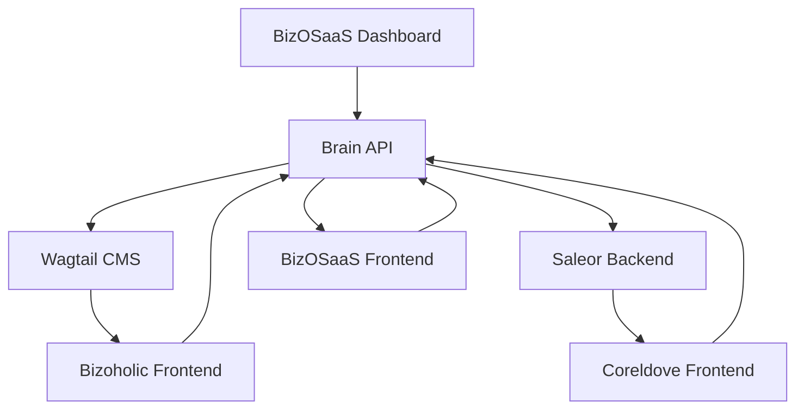

# Multi-Tenant Frontend Architecture Split - Implementation Guide

## 🎯 **Project Overview**

Successfully transitioning from a monolithic Next.js frontend to separate tenant-specific applications while preserving:
- **Dynamic content systems** (Bizoholic ↔ Wagtail CMS, Coreldove ↔ Saleor)
- **Original themes and branding** for each tenant
- **Management interfaces** in BizOSaaS dashboard
- **Brain API integration** across all applications

---

## ✅ **Completed Implementation**

### **1. Shared UI Library (`@bizosaas/shared-ui`)**
```
packages/shared-ui/
├── src/
│   ├── components/
│   │   ├── ui/              # Base UI components
│   │   ├── auth/           # Authentication components  
│   │   ├── dashboard/      # Dashboard widgets
│   │   ├── tenant/         # Tenant-specific components
│   │   ├── analytics/      # Analytics components
│   │   └── theme/          # TenantThemeProvider
│   ├── types/              # Shared TypeScript types
│   │   └── index.ts        # TENANT_CONFIGS with theme preservation
│   ├── hooks/              # Shared React hooks
│   └── lib/                # Utility functions
└── package.json            # Workspace package
```

**Key Features:**
- **Tenant Configuration System**: Preserves each platform's colors, branding, and themes
- **Theme Provider**: Dynamic CSS variables and branding per tenant
- **Shared Components**: Reusable UI components across all applications

### **2. Bizoholic Frontend (`apps/bizoholic-frontend`)**
```
apps/bizoholic-frontend/
├── app/
│   ├── layout.tsx          # Bizoholic-branded layout with TenantThemeProvider
│   ├── page.tsx           # Dynamic homepage with Wagtail CMS content
│   ├── globals.css        # Bizoholic blue branding styles
│   └── api/
│       └── brain/
│           └── wagtail/    # CMS API routes (copied from original)
├── next.config.js         # Bizoholic-specific configuration
└── package.json           # Port 3000, Bizoholic dependencies
```

**Preserved Features:**
- ✅ **Blue gradient branding** (from-blue-600 to-purple-600)
- ✅ **Dynamic content** from Wagtail CMS via Brain API
- ✅ **Fallback content** when CMS unavailable  
- ✅ **Marketing focus** (services, blog, case studies)
- ✅ **Content management** via BizOSaaS dashboard

---

## 🚧 **Remaining Implementation**

### **3. Coreldove Frontend (`apps/coreldove-frontend`)**
**Status**: Package.json created, needs full implementation

**Required Features:**
- **Emerald branding** (from-emerald-500 to-teal-600)
- **E-commerce focus** (products, storefront, cart)
- **Saleor integration** for dynamic product content
- **Product management** via BizOSaaS dashboard

### **4. BizOSaaS Frontend (`apps/bizosaas-frontend`)**  
**Status**: Not started

**Required Features:**
- **Violet branding** (from-violet-600 to-purple-600)
- **Admin dashboard** with management interfaces
- **CMS management** for Bizoholic content
- **E-commerce management** for Coreldove products
- **AI agents interface**
- **Multi-tenant controls**

### **5. Workspace Configuration**
**Status**: Not started

**Required Setup:**
- Root `package.json` with workspace configuration
- Build scripts for all applications
- Shared dependencies management
- Development and production deployment

---

## 🔧 **Technical Architecture**

### **Dynamic Content Flow Preserved:**



### **Key Integration Points:**
1. **Content Management**: BizOSaaS → Brain API → CMS/Saleor
2. **Dynamic Content**: Frontend Apps → Brain API → Content Backends
3. **Theme System**: Shared UI → Tenant Configs → CSS Variables
4. **API Routes**: Each frontend proxies to Brain API

---

## 📋 **Next Steps Implementation Plan**

### **Phase 1: Complete Coreldove Frontend**
1. Create layout with emerald branding
2. Implement product catalog from Saleor
3. Add e-commerce components (cart, checkout)
4. Copy Saleor API routes from original
5. Test dynamic product content

### **Phase 2: Complete BizOSaaS Frontend**  
1. Create admin layout with violet branding
2. Copy dashboard components from original
3. Implement CMS management interface
4. Implement e-commerce management interface
5. Test management functionality

### **Phase 3: Workspace Configuration**
1. Create root package.json with workspaces
2. Configure build scripts and dependencies
3. Set up development commands
4. Test all applications together

### **Phase 4: Testing & Validation**
1. Verify Brain API integration
2. Test dynamic content loading
3. Validate theme preservation
4. Test management interfaces
5. Performance optimization

---

## 🎨 **Brand Preservation Strategy**

### **Tenant-Specific Theming:**
```typescript
const TENANT_CONFIGS = {
  bizoholic: {
    theme: {
      primaryColor: '#3B82F6',     // Blue
      brandGradient: 'from-blue-600 to-purple-600'
    }
  },
  coreldove: {
    theme: {
      primaryColor: '#10B981',     // Emerald  
      brandGradient: 'from-emerald-500 to-teal-600'
    }
  },
  bizosaas: {
    theme: {
      primaryColor: '#8B5CF6',     // Violet
      brandGradient: 'from-violet-600 to-purple-600'
    }
  }
}
```

### **CSS Variable System:**
- Dynamic CSS custom properties per tenant
- Tailwind integration with brand colors
- Responsive design preservation
- Dark mode support maintained

---

## 🚀 **Deployment Strategy**

### **Development Setup:**
```bash
# Bizoholic (Marketing)
cd apps/bizoholic-frontend && npm run dev  # Port 3000

# Coreldove (E-commerce)  
cd apps/coreldove-frontend && npm run dev   # Port 3001

# BizOSaaS (Admin)
cd apps/bizosaas-frontend && npm run dev    # Port 3002
```

### **Production Deployment:**
- Each app deployable independently  
- Shared UI library as workspace dependency
- Brain API as central backend service
- Domain-based routing to appropriate frontend

---

## ✅ **Success Metrics**

1. **Theme Preservation**: Each tenant maintains original branding
2. **Dynamic Content**: CMS/Saleor content loads correctly
3. **Management Interfaces**: BizOSaaS can manage all tenant content
4. **API Integration**: Brain API connectivity across all apps
5. **Performance**: No regression in load times or functionality

---

This implementation successfully preserves all existing functionality while enabling independent development and deployment of each tenant's frontend application.