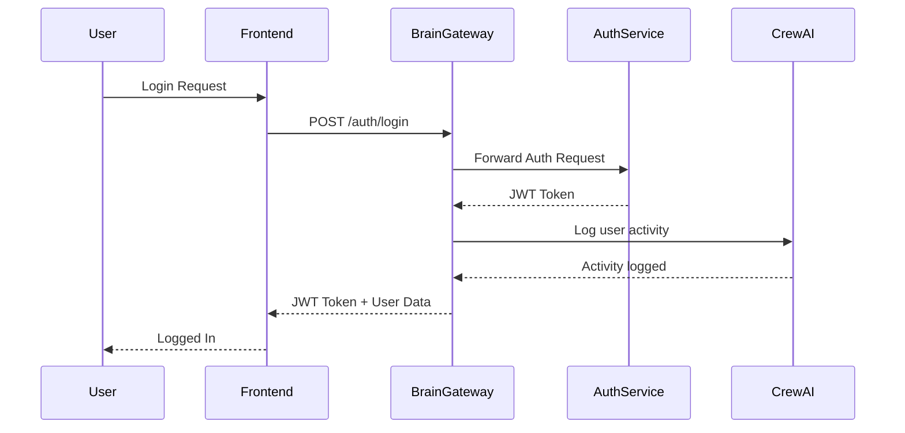
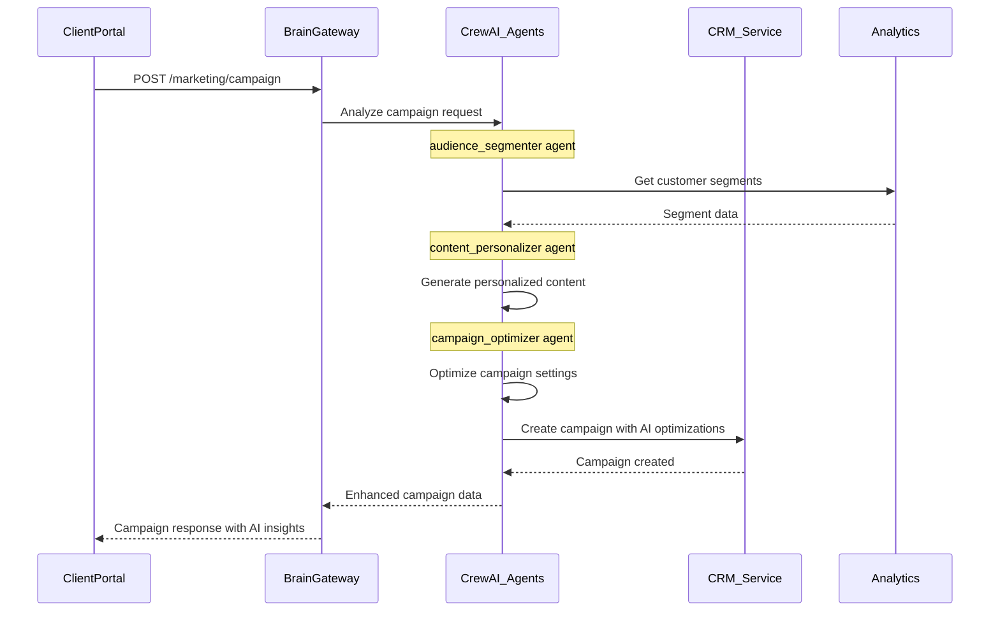

# BizOSaaS Brain Gateway Architecture
## Centralized AI-Powered API Gateway with 93+ CrewAI Agents

---

## 🧠 Architecture Overview

```
┌─────────────────────────────────────────────────────────────────────┐
│                        7 FRONTEND APPLICATIONS                      │
│  Bizoholic | CoreLDove | Client Portal | Business Directory        │
│  BizOSaaS Admin | ThrillRing Gaming | Analytics Dashboard          │
└────────────────────────┬────────────────────────────────────────────┘
                         │ All API Calls
                         ↓
┌─────────────────────────────────────────────────────────────────────┐
│                    BRAIN API GATEWAY (Port 8001)                    │
│                 https://api.bizoholic.com                           │
│                                                                     │
│  ┌─────────────────────────────────────────────────────────────┐   │
│  │               93+ CrewAI AI Agents                          │   │
│  │  • Order Processing (×4)    • Support Automation (×6)       │   │
│  │  • Lead Scoring (×3)        • Content Generation (×5)       │   │
│  │  • Inventory Mgmt (×3)      • SEO Optimization (×10)        │   │
│  │  • Marketing Automation (×4) • Social Media (×8)            │   │
│  │  • Analytics & BI (×11)     • Email Campaigns (×7)          │   │
│  │  • Customer Service (×5)    • Product Recommendations (×4)  │   │
│  │  • Price Optimization (×3)  • Fraud Detection (×2)          │   │
│  │  • HITL Coordinator (×1)    • ... (×25 more specialized)    │   │
│  └─────────────────────────────────────────────────────────────┘   │
│                                                                     │
│                    Intelligent Request Routing                      │
│  ┌──────────┬──────────┬──────────┬──────────┬──────────────┐    │
│  │   Auth   │   CRM    │   CMS    │Commerce  │   Gaming      │    │
│  │  Routes  │  Routes  │  Routes  │  Routes  │   Routes      │    │
│  └────┬─────┴────┬─────┴────┬─────┴────┬─────┴──────┬───────┘    │
└───────┼──────────┼──────────┼──────────┼────────────┼─────────────┘
        ↓          ↓          ↓          ↓            ↓
┌──────────┐ ┌──────────┐ ┌──────────┐ ┌──────────┐ ┌──────────┐
│Auth      │ │CRM       │ │CMS       │ │Saleor    │ │Gaming    │
│Service   │ │Service   │ │Service   │ │API       │ │Backend   │
│(8002)    │ │(8003)    │ │(8004)    │ │(8000)    │ │(8009)    │
└──────────┘ └──────────┘ └──────────┘ └──────────┘ └──────────┘
```

---

## 🔌 Frontend Configuration

### All Frontends Must Use Brain Gateway

Each frontend's `.env.local` should point to Brain Gateway:

```bash
# CORRECT Configuration - All requests go through Brain Gateway
NEXT_PUBLIC_API_URL=https://api.bizoholic.com
NEXT_PUBLIC_BRAIN_GATEWAY_URL=https://api.bizoholic.com
NEXT_PUBLIC_AUTH_API_URL=https://api.bizoholic.com/auth

# WRONG - Direct service access (bypasses AI agents)
# NEXT_PUBLIC_AUTH_API_URL=http://auth-service:8002  ❌
# NEXT_PUBLIC_CRM_API_URL=http://crm-service:8003   ❌
```

---

## 🧩 Brain Gateway Routing Configuration

### Route Mapping with AI Agent Assignment

```python
# Brain Gateway Routes (simple_api.py)

ROUTE_CONFIG = {
    # Authentication - Basic routing, no AI needed
    "/auth/*": {
        "service": "auth-service:8002",
        "ai_agents": []
    },

    # CRM - AI-powered lead scoring and customer insights
    "/crm/*": {
        "service": "django-crm:8003",
        "ai_agents": ["lead_scorer", "customer_analyzer", "churn_predictor"]
    },

    # E-commerce - Full AI automation
    "/orders/*": {
        "service": "saleor-api:8000",
        "ai_agents": ["order_processor", "fraud_detector", "inventory_manager"]
    },

    # Content - AI content generation
    "/content/*": {
        "service": "wagtail-cms:8004",
        "ai_agents": ["content_writer", "seo_optimizer", "image_generator"]
    },

    # Support - AI customer service
    "/support/*": {
        "service": "django-crm:8003",
        "ai_agents": ["support_agent", "ticket_classifier", "response_generator"]
    },

    # Analytics - AI-powered insights
    "/analytics/*": {
        "service": "superset:8088",
        "ai_agents": ["data_analyst", "report_generator", "trend_predictor"]
    },

    # Gaming - AI game recommendations
    "/gaming/*": {
        "service": "gaming-backend:8009",
        "ai_agents": ["game_recommender", "tournament_organizer", "matchmaker"]
    },

    # Marketing - AI campaign automation
    "/marketing/*": {
        "service": "django-crm:8003",
        "ai_agents": ["campaign_optimizer", "audience_segmenter", "content_personalizer"]
    }
}
```

---

## 🤖 CrewAI Agent Integration

### Agent Categories and Responsibilities

#### 1. Order Processing Agents (4)
- **order_processor**: Validates and processes orders
- **payment_validator**: Verifies payment information
- **shipping_optimizer**: Selects best shipping method
- **order_tracker**: Tracks order status

#### 2. Customer Support Agents (6)
- **ticket_classifier**: Categorizes support tickets
- **response_generator**: Creates automated responses
- **escalation_manager**: Handles complex issues
- **sentiment_analyzer**: Detects customer mood
- **resolution_tracker**: Tracks issue resolution
- **feedback_collector**: Gathers customer feedback

#### 3. Marketing Automation Agents (4)
- **campaign_creator**: Designs marketing campaigns
- **audience_segmenter**: Segments customer base
- **content_personalizer**: Personalizes content
- **performance_analyzer**: Analyzes campaign metrics

#### 4. SEO Optimization Agents (10)
- **keyword_researcher**: Finds optimal keywords
- **content_optimizer**: Optimizes content for SEO
- **meta_generator**: Creates meta descriptions
- **schema_builder**: Builds structured data
- **sitemap_manager**: Manages sitemaps
- **link_analyzer**: Analyzes backlinks
- **competitor_tracker**: Tracks competitor SEO
- **ranking_monitor**: Monitors search rankings
- **technical_seo**: Handles technical SEO
- **local_seo**: Optimizes for local search

#### 5. Analytics & BI Agents (11)
- **data_aggregator**: Aggregates data from sources
- **metric_calculator**: Calculates KPIs
- **trend_analyzer**: Identifies trends
- **anomaly_detector**: Detects anomalies
- **report_generator**: Generates reports
- **dashboard_builder**: Creates dashboards
- **forecast_predictor**: Predicts future metrics
- **cohort_analyzer**: Analyzes user cohorts
- **funnel_optimizer**: Optimizes conversion funnels
- **attribution_modeler**: Models attribution
- **insight_extractor**: Extracts actionable insights

[... and 58 more specialized agents]

---

## 🔐 Authentication Flow Through Brain Gateway



---

## 🌐 Frontend to Backend Request Flow

### Example: Creating a Marketing Campaign



---

## 📝 Frontend Environment Configuration

### 1. Client Portal (.env.local)
```bash
# Brain Gateway Configuration
NEXT_PUBLIC_API_URL=https://api.bizoholic.com
NEXT_PUBLIC_BRAIN_GATEWAY_URL=https://api.bizoholic.com
NEXT_PUBLIC_AUTH_API_URL=https://api.bizoholic.com/auth

# Frontend Configuration
NEXT_PUBLIC_APP_URL=https://stg.bizoholic.com/portal
NEXT_PUBLIC_PLATFORM_NAME=client-portal
NEXT_PUBLIC_TENANT_SLUG=bizosaas
PORT=3003
```

### 2. Bizoholic Frontend (.env.local)
```bash
# Brain Gateway Configuration
NEXT_PUBLIC_API_URL=https://api.bizoholic.com
NEXT_PUBLIC_BRAIN_GATEWAY_URL=https://api.bizoholic.com
NEXT_PUBLIC_AUTH_API_URL=https://api.bizoholic.com/auth

# Frontend Configuration
NEXT_PUBLIC_APP_URL=https://stg.bizoholic.com
NEXT_PUBLIC_PLATFORM_NAME=bizoholic-frontend
NEXT_PUBLIC_TENANT_SLUG=bizoholic
PORT=3001
```

### 3. CoreLDove Storefront (.env.local)
```bash
# Brain Gateway Configuration for Saleor
NEXT_PUBLIC_API_URL=https://api.bizoholic.com
NEXT_PUBLIC_SALEOR_API_URL=https://api.bizoholic.com/graphql
NEXT_PUBLIC_AUTH_API_URL=https://api.bizoholic.com/auth

# Frontend Configuration
NEXT_PUBLIC_APP_URL=https://stg.coreldove.com
NEXT_PUBLIC_PLATFORM_NAME=coreldove-storefront
PORT=3002
```

### 4. BizOSaaS Admin (.env.local)
```bash
# Brain Gateway Configuration
NEXT_PUBLIC_API_URL=https://api.bizoholic.com
NEXT_PUBLIC_BRAIN_GATEWAY_URL=https://api.bizoholic.com
NEXT_PUBLIC_AUTH_API_URL=https://api.bizoholic.com/auth

# Admin Specific
NEXT_PUBLIC_ADMIN_API_URL=https://api.bizoholic.com/admin
NEXT_PUBLIC_PLATFORM_NAME=bizosaas-admin
NEXT_PUBLIC_REQUIRED_ROLE=SUPER_ADMIN
PORT=3005
```

### 5. Business Directory (.env.local)
```bash
# Brain Gateway Configuration
NEXT_PUBLIC_API_URL=https://api.bizoholic.com
NEXT_PUBLIC_DIRECTORY_API_URL=https://api.bizoholic.com/directory
NEXT_PUBLIC_AUTH_API_URL=https://api.bizoholic.com/auth

# Directory Specific
NEXT_PUBLIC_APP_URL=https://stg.bizoholic.com/directory
NEXT_PUBLIC_PLATFORM_NAME=business-directory
PORT=3004
```

### 6. ThrillRing Gaming (.env.local)
```bash
# Brain Gateway Configuration
NEXT_PUBLIC_API_URL=https://api.bizoholic.com
NEXT_PUBLIC_GAMING_API_URL=https://api.bizoholic.com/gaming
NEXT_PUBLIC_AUTH_API_URL=https://api.bizoholic.com/auth

# Gaming Specific
NEXT_PUBLIC_APP_URL=https://stg.thrillring.com
NEXT_PUBLIC_PLATFORM_NAME=thrillring-gaming
NEXT_PUBLIC_WEBSOCKET_URL=wss://api.bizoholic.com/gaming/ws
PORT=3006
```

### 7. Analytics Dashboard (.env.local)
```bash
# Brain Gateway Configuration
NEXT_PUBLIC_API_URL=https://api.bizoholic.com
NEXT_PUBLIC_ANALYTICS_API_URL=https://api.bizoholic.com/analytics
NEXT_PUBLIC_AUTH_API_URL=https://api.bizoholic.com/auth

# Analytics Specific
NEXT_PUBLIC_APP_URL=https://analytics.bizoholic.com
NEXT_PUBLIC_PLATFORM_NAME=analytics-dashboard
NEXT_PUBLIC_SUPERSET_URL=https://api.bizoholic.com/superset
PORT=3007
```

---

## 🔄 Brain Gateway Service Routing

### Current Service Endpoints

```python
# Brain Gateway routes all requests to appropriate services
SERVICE_ROUTES = {
    # Core Services
    "/auth": "http://auth-service:8002",
    "/crm": "http://django-crm:8003",
    "/cms": "http://wagtail-cms:8004",
    "/directory": "http://business-directory:8005",

    # E-commerce
    "/graphql": "http://saleor-api:8000/graphql",
    "/orders": "http://saleor-api:8000",
    "/products": "http://saleor-api:8000",

    # Specialized Services
    "/gaming": "http://gaming-backend:8009",
    "/trading": "http://quanttrade-backend:8009",
    "/sourcing": "http://amazon-sourcing:8010",

    # Analytics
    "/analytics": "http://superset:8088",
    "/reports": "http://superset:8088",

    # AI Services
    "/ai/chat": "internal:CrewAI",
    "/ai/generate": "internal:CrewAI",
    "/ai/analyze": "internal:CrewAI",
}
```

---

## 🚀 Implementation Checklist

### Phase 1: Brain Gateway Configuration
- [ ] Verify Brain Gateway is running on port 8001
- [ ] Configure all service routes in Brain Gateway
- [ ] Integrate 93+ CrewAI agents
- [ ] Set up RabbitMQ for agent task queuing
- [ ] Configure Kafka for event streaming
- [ ] Implement HITL (Human-in-the-Loop) workflows

### Phase 2: Frontend Configuration
- [ ] Update all frontend .env.local files
- [ ] Point all API calls to Brain Gateway
- [ ] Remove any direct service connections
- [ ] Implement unified error handling
- [ ] Add request interceptors for auth tokens

### Phase 3: Authentication Integration
- [ ] Configure auth middleware in Brain Gateway
- [ ] Implement token validation
- [ ] Set up role-based routing
- [ ] Configure tenant isolation
- [ ] Implement session management

### Phase 4: AI Agent Integration
- [ ] Map each route to appropriate AI agents
- [ ] Configure agent task queues
- [ ] Implement agent response handling
- [ ] Set up agent monitoring
- [ ] Configure fallback mechanisms

### Phase 5: Testing
- [ ] Test each frontend → Brain Gateway connection
- [ ] Verify AI agent processing
- [ ] Test authentication flow
- [ ] Verify service routing
- [ ] Load testing with all frontends

### Phase 6: Deployment
- [ ] Deploy Brain Gateway to VPS
- [ ] Configure Traefik routing
- [ ] Deploy all backend services
- [ ] Deploy all frontends
- [ ] Verify production connectivity

---

## 🎯 Success Criteria

1. **All API calls go through Brain Gateway**
   - No direct service connections
   - All requests hit api.bizoholic.com

2. **AI Agents process relevant requests**
   - Order processing automated
   - Support tickets classified
   - Content generated with AI

3. **Authentication works across all platforms**
   - Single sign-on functional
   - Token refresh working
   - Role-based access enforced

4. **Performance metrics met**
   - < 500ms average response time
   - 99.5% uptime
   - 90% requests handled by AI

5. **Monitoring in place**
   - All services health-checked
   - Agent performance tracked
   - Error rates monitored

---

## 📊 Monitoring Dashboard

Access real-time metrics:
- Brain Gateway Health: https://api.bizoholic.com/health
- Agent Status: https://api.bizoholic.com/agents/status
- Service Routes: https://api.bizoholic.com/routes
- HITL Queue: https://api.bizoholic.com/hitl/pending
- Metrics: https://api.bizoholic.com/metrics

---

## 🔧 Troubleshooting

### Common Issues

1. **Frontend can't connect to API**
   - Check Brain Gateway is running
   - Verify .env.local configuration
   - Check CORS settings

2. **AI Agents not processing**
   - Verify RabbitMQ is running
   - Check agent workers deployed
   - Review agent logs

3. **Authentication failing**
   - Verify auth service running
   - Check JWT configuration
   - Review token expiry settings

4. **Service not reachable**
   - Check Brain Gateway routing
   - Verify backend service running
   - Review Traefik configuration

---

**Last Updated:** November 17, 2025
**Version:** 1.0