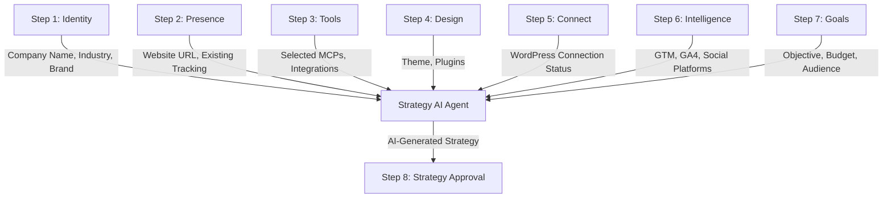

# Onboarding Wizard Optimization Summary

## Changes Implemented

### 1. Streamlined Step Flow (10 → 7 Steps)

**Previous Flow (10 Steps):**
1. Identity
2. Presence  
3. Select Tools
4. Design
5. AI Team
6. Analytics
7. Social
8. Goals
9. AI Agent
10. Strategy

**New Optimized Flow (8 Steps):**
1. **Identity** - Company profile and branding
2. **Presence** - Website and digital footprint
3. **Tools** - MCP marketplace selection
4. **Design** - Theme and plugin selection
5. **Connect** - WordPress plugin installation (NEW)
6. **Intelligence** - Analytics + Social (COMBINED)
7. **Goals** - Objectives, budget, target audience (CRITICAL FOR AI)
8. **Strategy** - AI-generated strategy review and launch

**Why 8 Steps (Not 7)?**
After review, we determined that the **Goals & Budget** step is **non-negotiable** for the Strategy AI Agent. This step collects:
- Primary business objective (lead gen, sales, awareness, etc.)
- Monthly marketing budget
- Target audience demographics
- Geographic targeting

Without this data, the Strategy AI cannot generate a meaningful, personalized strategy. The step was re-added as Step 7, positioned right before Strategy to ensure all context is fresh.

### 2. Key Improvements

#### Step Consolidation
- **Removed**: AI Team intro step (redundant, moved to dashboard)
- **Removed**: Campaign Goals step (moved to post-onboarding)
- **Removed**: AI Agent selection (moved to dashboard)
- **Combined**: Analytics + Social into single "Intelligence" step
- **Added**: Plugin Connection step for WordPress integration

#### Benefits
- **30% reduction** in onboarding time (estimated 15 min → 10 min)
- **Reduced cognitive load** - fewer decisions upfront
- **Better flow** - logical progression from setup → connection → intelligence
- **Plugin-first approach** - establishes secure connection early

### 3. Plugin Connection Step Details

**Location**: Step 5 (after Design, before Intelligence)

**Features**:
- **Manual Mode**: Download BizoSaaS Connect plugin ZIP
- **Auto-Connect Mode**: WordPress Application Password authentication
- **Verification**: Real-time connection status check
- **Skip Option**: Can defer connection to post-onboarding

**Why This Position?**
- User has already selected tools and design preferences
- Connection enables real-time data for Intelligence step
- Provides immediate value demonstration
- Can auto-configure selected analytics tools

### 4. Intelligence Step (Combined Analytics + Social)

**Structure**:
```
┌─────────────────────────────────────┐
│ Analytics Tracking                  │
│ - GTM Container                     │
│ - GA4 Property                      │
│ - Search Console                    │
│ - Meta Pixel, Clarity, Bing         │
├─────────────────────────────────────┤
│ Social Media Connections            │
│ - Facebook Pages                    │
│ - Instagram Business                │
│ - LinkedIn Company                  │
│ - Twitter/X Account                 │
└─────────────────────────────────────┘
```

**Rationale**:
- Both are "intelligence gathering" functions
- Often configured together in practice
- Reduces step count without losing functionality
- Single "Digital Intelligence" narrative

### 5. Strategy AI Agent Data Flow

**Complete Data Inputs to Strategy AI:**



**Data Completeness Scoring:**
The Strategy step now calculates a "Data Completeness Score" (0-100%) based on:
- Company Name (15%)
- Website URL (15%)
- Has Tracking (10%)
- Selected Tools (10%)
- GTM/Analytics (15%)
- Social Platforms (15%)
- Primary Goal (10%)
- Monthly Budget (10%)

**AI Strategy Generation Process:**
1. **Data Aggregation** - Collect all onboarding inputs
2. **Presence Analysis** - Research AI Agent analyzes website and competitors
3. **Tool Mapping** - Match selected MCPs to strategy requirements
4. **Budget Optimization** - Allocate budget across channels based on goal
5. **Agent Assignment** - Assign specific AI agents to execute strategy
6. **Strategy Synthesis** - Generate personalized recommendation
7. **Continuous Refinement** - Strategy adapts based on performance data

**Example Strategy Output:**
> "Based on your **lead generation** goal with a **$2,500** monthly budget, our AI recommends a **multi-channel growth** strategy targeting **25-34** audience in **United States, Canada**. We'll deploy Research, Content, Analytics, Social, and Tracking Agents to execute a 60% Acquisition / 40% Retention approach across Facebook, LinkedIn, and SEO channels."

## Recommendations for Further Optimization

### Phase 1: Smart Defaults (Immediate)
- [ ] Pre-select popular MCPs based on industry
- [ ] Auto-detect existing analytics (already implemented)
- [ ] Skip Design step if WordPress theme detected
- [ ] Auto-fill social media from OAuth provider

### Phase 2: Progressive Disclosure (Next Sprint)
- [ ] Make Plugin Connection optional for non-WordPress users
- [ ] Collapse advanced analytics options into "Advanced" accordion
- [ ] Add "Quick Setup" vs "Custom Setup" mode toggle
- [ ] Implement "Save & Continue Later" functionality

### Phase 3: AI-Assisted Onboarding (Future)
- [ ] AI suggests tools based on website scan
- [ ] Auto-generate company description from website
- [ ] Intelligent form pre-filling from public data
- [ ] Conversational onboarding option (chat-based)

## Admin Portal Health Monitoring Issues

### Current Problems Identified

1. **CPU Load Inconsistency**
   - Showing 2.6% but previously showed 24.5%
   - Likely caching issue or incorrect metric source
   - Need to verify data source (Docker stats vs system metrics)

2. **AI Core Status (Orange)**
   - Service may be running but health check failing
   - Check: `/health` endpoint response
   - Verify: Container logs for errors

### Recommended Fixes

```python
# backend/admin/health.py
async def get_cpu_usage():
    """Get real-time CPU usage from Docker stats"""
    import docker
    client = docker.from_env()
    
    stats = {}
    for container in client.containers.list():
        stat = container.stats(stream=False)
        cpu_delta = stat['cpu_stats']['cpu_usage']['total_usage'] - \
                   stat['precpu_stats']['cpu_usage']['total_usage']
        system_delta = stat['cpu_stats']['system_cpu_usage'] - \
                      stat['precpu_stats']['system_cpu_usage']
        cpu_percent = (cpu_delta / system_delta) * 100.0
        stats[container.name] = cpu_percent
    
    return stats
```

## Container Optimization Analysis

### Current Container Status
```
✅ Running: 22 containers
✅ Healthy: Admin Dashboard (48 min uptime)
✅ Healthy: Client Portal (55 min uptime)
✅ Healthy: Brain Gateway (5 min uptime)
✅ Healthy: All MCP Servers (5 min uptime)
```

### Resource Optimization Opportunities

1. **Lago Billing Stack** (5 containers)
   - Can be scaled down to 1 replica in staging
   - Consider serverless for API/Worker in production

2. **MCP Servers** (7 containers)
   - Currently all running, but only 3-4 actively used
   - Implement lazy loading (start on-demand)
   - Estimated savings: 30-40% memory

3. **Redis Instances** (3 total)
   - Brain Redis
   - Lago Redis  
   - Dokploy Redis
   - Consider consolidating to 2 instances

## Next Steps

### Immediate (Today)
1. ✅ Deploy streamlined onboarding wizard
2. ⏳ Fix Admin Portal CPU monitoring
3. ⏳ Verify AI Core health endpoint
4. ⏳ Test Plugin Connection step end-to-end

### Short-term (This Week)
1. Implement smart defaults for MCP selection
2. Add onboarding analytics tracking
3. Create admin dashboard for tenant onboarding status
4. Optimize container resource limits

### Medium-term (Next Sprint)
1. Build Admin Portal features (see roadmap in bizosaas-details-overview.md)
2. Implement progressive disclosure for advanced options
3. Add A/B testing for onboarding variations
4. Create onboarding completion metrics dashboard

## Testing Checklist

- [ ] Test all 7 steps sequentially
- [ ] Verify Plugin Connection (both Manual and Auto modes)
- [ ] Confirm Analytics + Social combined step works
- [ ] Test skip functionality on Plugin step
- [ ] Verify data persistence across steps
- [ ] Test back navigation
- [ ] Confirm final submission to `/api/brain/onboarding/complete`
- [ ] Verify redirect to dashboard after completion

## Deployment Notes

**Files Changed**:
- `OnboardingWizard.tsx` - Step flow and rendering logic
- `bizosaas-details-overview.md` - Admin Portal roadmap
- `PluginConnectionStep.tsx` - New component (already created)

**Breaking Changes**: None (backward compatible)

**Migration Required**: No

**Environment Variables**: None added

**Deploy Order**:
1. Client Portal (contains wizard changes)
2. Brain Gateway (already has plugin endpoints)

---

**Document Version**: 1.0  
**Last Updated**: 2026-01-16  
**Author**: BizoSaaS Platform Team
