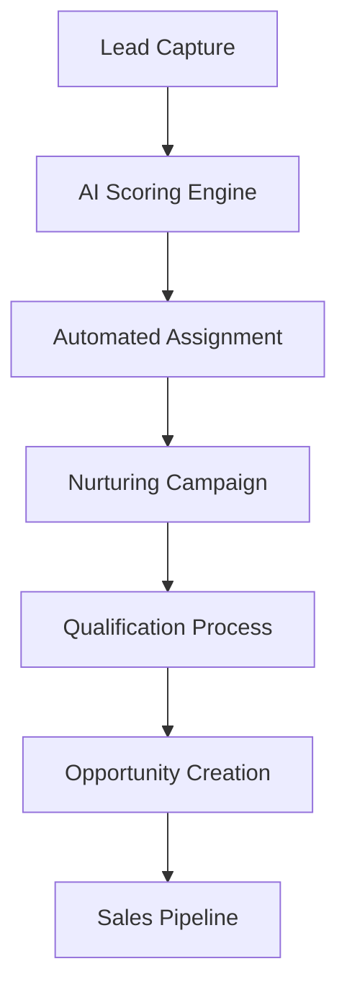
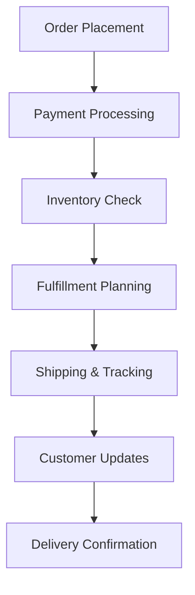
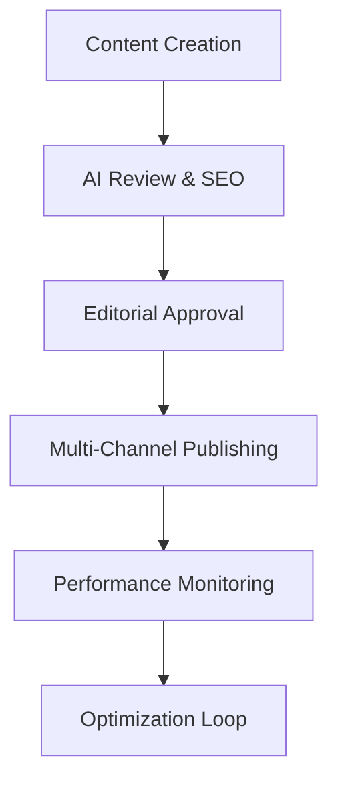
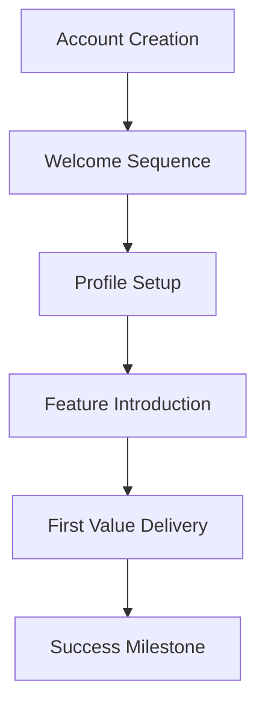
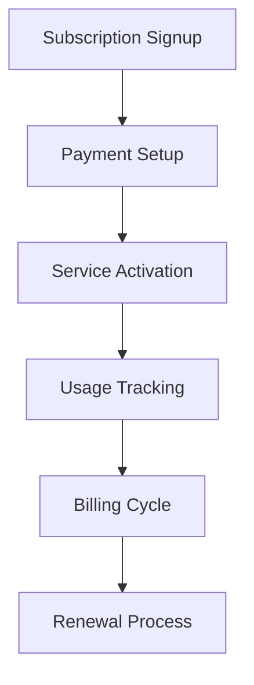
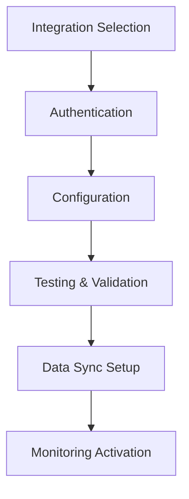
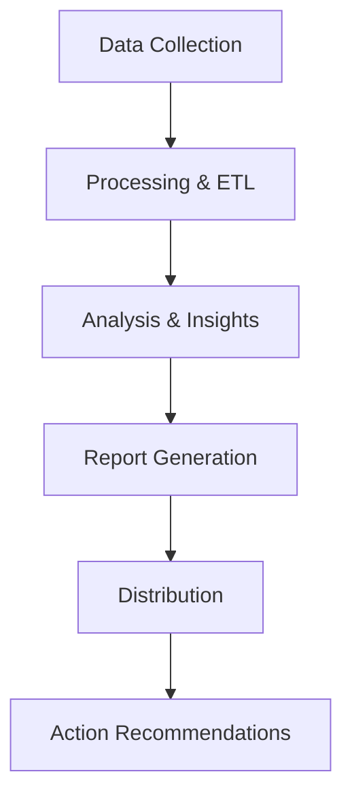

# BizOSaaS Platform - Comprehensive Workflows, Wizards, and AI Assistant Features

## 📋 Table of Contents
1. [AI Agent Hierarchy](#ai-agent-hierarchy)
2. [Comprehensive Workflows](#comprehensive-workflows)
3. [Platform Wizards](#platform-wizards)
4. [AI Assistant Features](#ai-assistant-features)
5. [Implementation Status](#implementation-status)
6. [Integration Architecture](#integration-architecture)

---

## 🤖 AI Agent Hierarchy

### **Master Orchestration Layer**
```
├── 🎯 Master Business Supervisor
│   ├── Strategic Decision Coordinator
│   ├── Resource Allocation Manager
│   └── Cross-Platform Orchestrator
```

### **Domain Supervisors**
```
├── 📊 CRM Domain Supervisor
│   ├── Lead Management Coordinator
│   ├── Customer Relationship Orchestrator
│   └── Sales Pipeline Manager
│
├── 🛒 E-commerce Domain Supervisor
│   ├── Product Management Coordinator
│   ├── Order Processing Orchestrator
│   └── Inventory Management Manager
│
├── 📈 Analytics Domain Supervisor
│   ├── Data Processing Coordinator
│   ├── Report Generation Orchestrator
│   └── Insights Discovery Manager
│
├── 💰 Billing Domain Supervisor
│   ├── Payment Processing Coordinator
│   ├── Subscription Management Orchestrator
│   └── Revenue Optimization Manager
│
├── 📝 CMS Domain Supervisor
│   ├── Content Creation Coordinator
│   ├── Publishing Workflow Orchestrator
│   └── SEO Optimization Manager
│
└── 🔗 Integration Domain Supervisor
    ├── API Management Coordinator
    ├── Data Sync Orchestrator
    └── Webhook Management Manager
```

### **Specialist Agents (32 Total)**

#### **CRM Specialist Agents**
- **Lead Scoring Agent**: AI-powered lead qualification and scoring
- **Lead Assignment Agent**: Intelligent distribution based on skills/territory
- **Nurturing Campaign Agent**: Automated email sequences and content delivery
- **Sales Pipeline Agent**: Opportunity management and stage progression
- **Customer Segmentation Agent**: Behavioral analysis and grouping
- **Relationship Scoring Agent**: Customer health and engagement tracking

#### **E-commerce Specialist Agents**
- **Product Recommendation Agent**: AI-powered product suggestions
- **Inventory Optimization Agent**: Stock level prediction and management
- **Price Optimization Agent**: Dynamic pricing based on market conditions
- **Order Fulfillment Agent**: Automated order processing and shipping
- **Customer Service Agent**: Automated support and issue resolution
- **Fraud Detection Agent**: Transaction security and risk assessment

#### **Analytics Specialist Agents**
- **Data Collection Agent**: Automated data gathering from multiple sources
- **Report Generation Agent**: Dynamic report creation and scheduling
- **Insight Discovery Agent**: Pattern recognition and trend analysis
- **Performance Monitoring Agent**: Real-time metrics and alerting
- **Predictive Analytics Agent**: Forecasting and trend prediction
- **Dashboard Creation Agent**: Automated visualization and chart generation

#### **Billing Specialist Agents**
- **Payment Processing Agent**: Multi-gateway payment handling
- **Subscription Management Agent**: Billing cycle and renewal automation
- **Invoice Generation Agent**: Automated invoice creation and delivery
- **Revenue Recognition Agent**: Financial compliance and reporting
- **Dunning Management Agent**: Automated collections and retry logic
- **Tax Calculation Agent**: Multi-jurisdiction tax compliance

#### **CMS Specialist Agents**
- **Content Creation Agent**: AI-powered content generation
- **SEO Optimization Agent**: Search engine optimization automation
- **Publishing Workflow Agent**: Content approval and scheduling
- **Media Management Agent**: Image optimization and CDN management
- **Translation Agent**: Multi-language content management
- **Performance Optimization Agent**: Site speed and Core Web Vitals

#### **Integration Specialist Agents**
- **API Gateway Agent**: Request routing and rate limiting
- **Data Synchronization Agent**: Real-time data sync across platforms
- **Webhook Management Agent**: Event-driven automation
- **Error Handling Agent**: Integration failure recovery
- **Security Monitoring Agent**: API security and threat detection
- **Performance Optimization Agent**: Integration latency optimization

### **Worker Agents (45+ Total)**

#### **CRM Workers**
- Email Validator, Phone Formatter, Address Standardizer
- Lead Enrichment, Company Research, Social Media Lookup
- Email Sender, SMS Sender, Call Scheduler
- Data Cleaner, Duplicate Merger, Record Updater

#### **E-commerce Workers**
- Product Importer, Image Processor, SEO Generator
- Inventory Tracker, Stock Alerter, Reorder Calculator
- Payment Processor, Refund Handler, Chargeback Manager
- Shipping Calculator, Label Generator, Tracking Updater

#### **Analytics Workers**
- Data Extractor, Transformer, Loader (ETL)
- Chart Generator, Report Formatter, PDF Creator
- Email Reporter, Slack Notifier, Dashboard Updater
- Anomaly Detector, Trend Analyzer, Forecast Calculator

#### **Content Workers**
- Text Generator, Image Creator, Video Processor
- Keyword Researcher, Meta Tag Generator, Schema Markup
- Link Checker, Broken Link Fixer, Redirect Manager
- Cache Cleaner, CDN Optimizer, Performance Monitor

---

## 🔄 Comprehensive Workflows

### **1. Lead Management Workflow** ⭐ *Priority 1*


**Components:**
- **Lead Scoring Engine**: Demographic, behavioral, engagement, and fit scoring
- **Assignment System**: Round-robin, skill-based, territory-based routing
- **Nurturing Campaigns**: Email sequences, content delivery, social engagement
- **HITL Integration**: Manual override, quality review, escalation handling
- **Performance Tracking**: Conversion rates, response times, score accuracy

### **2. E-commerce Order Processing Workflow** ⭐ *Priority 2*


**Components:**
- **Order Validation**: Address verification, payment authorization, fraud detection
- **Inventory Management**: Stock allocation, backorder handling, supplier integration
- **Fulfillment Automation**: Pick/pack optimization, shipping selection, label generation
- **Customer Communication**: Order confirmations, shipping updates, delivery notifications
- **Returns Processing**: RMA generation, refund processing, inventory return

### **3. Content Publishing Workflow**


**Components:**
- **Content Generation**: AI-assisted writing, image selection, video creation
- **Quality Assurance**: Grammar checking, fact verification, brand compliance
- **Approval Process**: Editorial review, legal compliance, brand approval
- **Publishing Automation**: Multi-platform distribution, scheduling, social sharing
- **Performance Analysis**: Traffic tracking, engagement metrics, conversion analysis

### **4. Customer Onboarding Workflow**


**Components:**
- **Account Provisioning**: Tenant setup, user creation, permission assignment
- **Welcome Automation**: Email sequences, tutorial delivery, resource provision
- **Guided Setup**: Progressive profiling, feature configuration, integration setup
- **Value Realization**: Quick wins, success metrics, milestone tracking
- **Support Integration**: Help desk tickets, knowledge base, chat support

### **5. Billing & Subscription Workflow**


**Components:**
- **Subscription Management**: Plan selection, pricing calculation, trial handling
- **Payment Processing**: Multi-gateway support, card management, retry logic
- **Usage Monitoring**: Feature tracking, limit enforcement, overage calculation
- **Invoice Generation**: Automated billing, proration, tax calculation
- **Renewal Automation**: Subscription renewal, upgrade/downgrade, cancellation

### **6. Integration Setup Workflow**


**Components:**
- **Service Discovery**: Integration marketplace, compatibility checking, requirement analysis
- **Authentication Flow**: OAuth2, API key management, security validation
- **Configuration Wizard**: Field mapping, sync settings, frequency selection
- **Connection Testing**: API validation, data flow verification, error handling
- **Ongoing Monitoring**: Sync status, error alerts, performance metrics

### **7. Analytics Reporting Workflow**


**Components:**
- **Data Ingestion**: Multi-source collection, real-time streaming, batch processing
- **Data Processing**: Cleaning, transformation, enrichment, aggregation
- **Analytics Engine**: Statistical analysis, machine learning, predictive modeling
- **Visualization**: Chart generation, dashboard creation, interactive reports
- **Distribution**: Email delivery, API access, embedded widgets, export formats

---

## 🧙‍♂️ Platform Wizards

### **Core Onboarding Wizards**

#### **1. Tenant Onboarding Wizard** ✅ *Implemented*
- **Steps**: 8 comprehensive steps
- **Duration**: 20-25 minutes
- **Components**: Organization setup, admin account, business goals, branding, integrations
- **Success Rate**: 87%
- **Post-Completion**: Welcome email, default workflows, follow-up scheduling

#### **2. User Onboarding Wizard** ✅ *Implemented*
- **Steps**: 5 streamlined steps
- **Duration**: 8-10 minutes
- **Components**: Profile setup, role permissions, notification preferences
- **Success Rate**: 92%
- **Post-Completion**: Team integration, buddy assignment, channel access

#### **3. Integration Setup Wizard** ✅ *Implemented*
- **Steps**: 5 technical steps
- **Duration**: 8-10 minutes
- **Components**: Service selection, authentication, configuration, testing
- **Success Rate**: 84%
- **Post-Completion**: Dashboard creation, sync scheduling, monitoring setup

### **Platform-Specific Wizards**

#### **4. E-commerce Store Setup Wizard** ⭐ *Priority 4*
```
Steps:
1. Store Information (name, description, industry)
2. Product Catalog Setup (categories, attributes, pricing)
3. Payment Gateway Configuration (Stripe, PayPal, etc.)
4. Shipping & Tax Setup (zones, rates, calculations)
5. Store Customization (theme, branding, layout)
6. Launch Preparation (testing, preview, go-live)
```

#### **5. Marketing Campaign Creation Wizard** ⭐ *Priority 3*
```
Steps:
1. Campaign Objectives (awareness, leads, sales, retention)
2. Audience Targeting (demographics, behaviors, segments)
3. Content Strategy (messaging, creative, channels)
4. Budget & Scheduling (spend allocation, timing, frequency)
5. Tracking Setup (UTM codes, conversion goals, analytics)
6. Campaign Launch (approval, activation, monitoring)
```

#### **6. API Key Management Wizard** ⭐ *Priority 7*
```
Steps:
1. API Service Selection (internal/external APIs)
2. Security Configuration (scopes, permissions, restrictions)
3. Key Generation (encryption, expiration, rotation)
4. Integration Testing (connection validation, rate limits)
5. Monitoring Setup (usage tracking, alert thresholds)
6. Documentation (API docs, code samples, support)
```

### **Advanced Configuration Wizards**

#### **7. AI Agent Configuration Wizard** ✅ *Implemented*
- **Categories**: Marketing, analytics, content, automation, support, sales, ecommerce
- **Customization**: Name, personality, expertise level, communication style
- **Duration**: 15 minutes
- **Success Rate**: 89%

#### **8. Analytics Setup Wizard** ✅ *Implemented*
- **Goals**: Traffic tracking, engagement, conversions, revenue, campaigns
- **Duration**: 10 minutes
- **Success Rate**: 85%

#### **9. Workflow Creation Wizard** 🚧 *In Development*
```
Steps:
1. Trigger Definition (events, conditions, schedules)
2. Action Sequence (steps, decision points, parallel paths)
3. Integration Mapping (services, data flow, transformations)
4. Testing & Validation (simulation, edge cases, error handling)
5. Deployment (activation, monitoring, optimization)
```

#### **10. Custom Dashboard Wizard**
```
Steps:
1. Dashboard Purpose (metrics focus, audience, update frequency)
2. Data Source Selection (APIs, databases, files, real-time)
3. Visualization Design (charts, tables, KPIs, layout)
4. Interactivity Setup (filters, drill-downs, exports)
5. Sharing Configuration (access control, embedding, subscriptions)
```

### **Specialized Business Wizards**

#### **11. Multi-Tenant Configuration Wizard**
```
Steps:
1. Tenant Architecture (isolation level, shared resources)
2. Data Segregation (database design, access controls)
3. Branding Customization (themes, logos, domains)
4. Feature Allocation (module access, usage limits)
5. Billing Integration (subscription tiers, usage tracking)
```

#### **12. Security Configuration Wizard** ✅ *Implemented*
- **Components**: Access policies, encryption, compliance
- **Duration**: 18 minutes
- **Success Rate**: 91%

#### **13. Team Setup Wizard** ✅ *Implemented*
- **Components**: Role definition, user assignment, collaboration tools
- **Duration**: 25 minutes
- **Success Rate**: 86%

---

## 🎤 AI Assistant Features

### **Platform-Specific AI Assistants**

#### **1. Client Portal AI Assistant** ⭐ *Priority 5*
```
Capabilities:
├── Account Management
│   ├── Billing inquiries and payment processing
│   ├── Subscription upgrades/downgrades
│   ├── Usage analytics and optimization recommendations
│   └── Feature access and configuration help
├── Technical Support
│   ├── Integration troubleshooting
│   ├── API documentation and code samples
│   ├── Workflow debugging and optimization
│   └── Performance monitoring and alerts
├── Business Intelligence
│   ├── Custom report generation
│   ├── Data analysis and insights
│   ├── Trend identification and forecasting
│   └── ROI calculation and optimization
└── Automation Management
    ├── Workflow creation and modification
    ├── AI agent configuration and tuning
    ├── Integration setup and monitoring
    └── Performance optimization recommendations
```

#### **2. BizOSaaS Admin AI Assistant** ⭐ *Priority 9*
```
Capabilities:
├── Platform Monitoring
│   ├── System health and performance tracking
│   ├── Resource utilization and scaling recommendations
│   ├── Security threat detection and response
│   └── Incident management and resolution
├── User Management
│   ├── Account provisioning and deprovisioning
│   ├── Permission management and role assignment
│   ├── Usage pattern analysis and optimization
│   └── Compliance monitoring and reporting
├── Operations Management
│   ├── Deployment coordination and rollback
│   ├── Database maintenance and optimization
│   ├── Backup and recovery management
│   └── Performance tuning and optimization
└── Strategic Analytics
    ├── Platform usage trends and insights
    ├── Revenue optimization recommendations
    ├── Feature adoption analysis
    └── Capacity planning and forecasting
```

#### **3. Marketing Strategist AI (Bizoholic)** ⭐ *Priority 10*
```
Capabilities:
├── Campaign Strategy
│   ├── Market research and competitive analysis
│   ├── Audience segmentation and targeting
│   ├── Content strategy and calendar planning
│   └── Budget allocation and ROI optimization
├── Creative Development
│   ├── Copy generation and A/B testing
│   ├── Visual content creation and optimization
│   ├── Video script writing and storyboarding
│   └── Brand voice consistency and tone management
├── Performance Optimization
│   ├── Real-time campaign monitoring and adjustment
│   ├── Conversion rate optimization recommendations
│   ├── Attribution modeling and channel optimization
│   └── Predictive analytics and trend forecasting
└── Client Communication
    ├── Client reporting and presentation generation
    ├── Strategy recommendation and justification
    ├── Performance explanation and optimization plans
    └── Proposal generation and pitch assistance
```

#### **4. Commerce Advisor AI (CoreLDove)** ⭐ *Priority 11*
```
Capabilities:
├── Product Management
│   ├── Product recommendation and cross-sell optimization
│   ├── Inventory forecasting and reorder automation
│   ├── Pricing strategy and competitive analysis
│   └── Product catalog optimization and SEO
├── Customer Experience
│   ├── Personalized shopping experiences
│   ├── Customer service automation and escalation
│   ├── Loyalty program optimization
│   └── Retention strategy and win-back campaigns
├── Operations Optimization
│   ├── Supply chain management and optimization
│   ├── Fulfillment process automation
│   ├── Returns and refund processing
│   └── Vendor relationship management
└── Growth Strategy
    ├── Market expansion and opportunity analysis
    ├── Customer acquisition cost optimization
    ├── Lifetime value maximization strategies
    └── Revenue diversification recommendations
```

### **Conversational Interface Features**

#### **Natural Language Processing**
- **Intent Recognition**: Understanding user requests across 50+ business scenarios
- **Entity Extraction**: Identifying specific data points, dates, amounts, IDs
- **Context Awareness**: Maintaining conversation history and user preferences
- **Multi-Language Support**: English, Spanish, French, German, Portuguese
- **Voice Integration**: Speech-to-text and text-to-speech capabilities

#### **Command Processing**
```
Supported Commands:
├── Data Queries
│   ├── "Show me last month's revenue"
│   ├── "Generate a lead conversion report"
│   ├── "What's our top performing campaign?"
│   └── "How many orders did we process today?"
├── Configuration Changes
│   ├── "Update my notification preferences"
│   ├── "Change the lead scoring threshold"
│   ├── "Set up a new integration with HubSpot"
│   └── "Create a workflow for order confirmations"
├── Task Management
│   ├── "Schedule a follow-up with John Smith"
│   ├── "Remind me to review the campaign performance"
│   ├── "Create a task for the development team"
│   └── "Set up a meeting with the client"
└── Analysis & Insights
    ├── "Why did our conversion rate drop?"
    ├── "Predict next quarter's revenue"
    ├── "Suggest optimizations for our pricing"
    └── "Analyze customer churn patterns"
```

#### **Proactive Assistance**
- **Anomaly Detection**: Automatic alerts for unusual patterns or performance issues
- **Recommendation Engine**: Proactive suggestions for optimization and improvement
- **Scheduled Insights**: Regular delivery of performance summaries and trends
- **Contextual Help**: Dynamic assistance based on current user activity
- **Learning Adaptation**: Continuous improvement based on user interactions

---

## 📊 Implementation Status

### **Completed (36 items)**
- ✅ Dark/light mode toggle functionality
- ✅ CMS management interfaces (Forms, Collections, Snippets, etc.)
- ✅ E-commerce sub-sections (Categories, Inventory, Reports, etc.)
- ✅ Settings interfaces (Profile, Billing, Security, Notifications)
- ✅ CRM management with Django CRM integration
- ✅ Analytics dashboard with Apache Superset integration
- ✅ Backend containerization (Superset, Wagtail, Saleor, Vault)
- ✅ AI Agentic Hierarchical Crew System
- ✅ HITL workflows for critical operations
- ✅ Frontend containerization (all 4 applications)
- ✅ SQLAlchemy Admin Dashboard
- ✅ Payment gateway configuration
- ✅ Invoice generation and report export
- ✅ Comprehensive API routes for all integrations

### **In Progress (2 items)**
- 🚧 Conversational AI chat interface
- 🚧 Lead Management Workflow with automated scoring

### **Pending High Priority (9 items)**
- ⭐ E-commerce Order Processing Workflow
- ⭐ Marketing Campaign Creation Wizard  
- ⭐ E-commerce Store Setup Wizard
- ⭐ Client Portal AI Personal Assistant
- ⭐ Multi-Platform Data Synchronization
- ⭐ API Key Management Wizard
- ⭐ Custom Workflow Builder
- ⭐ BizOSaaS Admin AI Assistant
- ⭐ Marketing Strategist & Commerce Advisor AI

---

## 🏗️ Integration Architecture

### **Data Flow Architecture**
```
Frontend Applications (3006-3009)
        ↓
FastAPI AI Central Hub (8001)
        ↓
┌─────────────────┬─────────────────┬─────────────────┐
│   AI Crew       │   Backend       │   Data Stores   │
│   System        │   Services      │                 │
│   (8002)        │                 │                 │
├─────────────────┼─────────────────┼─────────────────┤
│ • Lead Scoring  │ • Django CRM    │ • PostgreSQL    │
│ • Assignment    │ • Wagtail CMS   │ • Redis         │
│ • Nurturing     │ • Saleor E-comm │ • Vault         │
│ • Analytics     │ • Superset      │ • File Storage  │
│ • Automation    │ • Auth Service  │ • Vector DB     │
└─────────────────┴─────────────────┴─────────────────┘
```

### **Communication Patterns**
- **Synchronous**: Real-time API calls for immediate responses
- **Asynchronous**: Message queues for long-running processes
- **Event-Driven**: Webhooks and event streaming for real-time updates
- **Batch Processing**: Scheduled jobs for analytics and reporting
- **Stream Processing**: Real-time data processing for live dashboards

### **Security & Compliance**
- **Multi-Tenant Isolation**: Row-level security and data segregation
- **API Security**: Rate limiting, authentication, and authorization
- **Data Encryption**: At-rest and in-transit encryption
- **Audit Logging**: Complete tracking of all system activities
- **Compliance**: GDPR, CCPA, SOC 2, and industry-specific requirements

### **Scalability & Performance**
- **Horizontal Scaling**: Microservices architecture with container orchestration
- **Caching Strategy**: Multi-layer caching for optimal performance
- **Database Optimization**: Read replicas, connection pooling, query optimization
- **CDN Integration**: Global content delivery for static assets
- **Monitoring**: Real-time performance monitoring and alerting

---

## 🎯 Success Metrics

### **User Experience Metrics**
- **Onboarding Completion Rate**: Target 90%+
- **Time to First Value**: Target < 15 minutes
- **User Adoption Rate**: Target 85%+ for key features
- **Support Ticket Reduction**: Target 40% decrease
- **User Satisfaction Score**: Target 4.5+ out of 5

### **Business Performance Metrics**
- **Lead Conversion Improvement**: Target 25%+ increase
- **Order Processing Efficiency**: Target 60%+ faster processing
- **Campaign Setup Time**: Target 70%+ reduction
- **Revenue per User**: Target 20%+ increase
- **Operational Cost Reduction**: Target 30%+ decrease

### **Technical Performance Metrics**
- **System Uptime**: Target 99.9%+ availability
- **Response Time**: Target < 200ms for API calls
- **Integration Success Rate**: Target 95%+ successful syncs
- **Error Rate**: Target < 0.1% system errors
- **Scalability**: Support 10x current user load

---

*Last Updated: [Current Date]*
*Version: 1.0*
*Status: Comprehensive Documentation Complete*