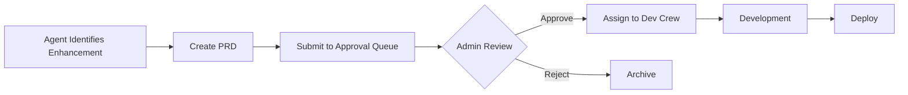

# BizOSaaS Platform: The Master AI-Native Digital Agency OS
**Date:** February 4, 2026  
**Version:** 5.0 (Complete Platform Specification)  
**Status:** 🟢 OPERATIONAL

---

## 📋 Quick Navigation

| Section | Description |
|---------|-------------|
| [Architecture](#2-technical-architecture--stack) | Hexagonal DDD architecture with Brain Gateway |
| [AI Agents](#3-the-autonomous-ai-agent-workforce) | 47+ agents across 8 crews |
| [MCP Registry](#4-mcp-server-registry) | 40+ Model Context Protocol servers |
| [Approval Workflows](#5-hitl-governance--approval-workflows) | Human-in-the-Loop governance |
| [RBAC](#6-role-based-access-control) | Hybrid Role + Subscription permissions |
| [Connectors](#7-external-service-connectors) | 42 direct adapters |

---

## 1. Executive Summary

BizOSaaS is a hyper-automated "Agency-in-a-Box" platform. It leverages an autonomous workforce of AI agents to manage technical infrastructure, execute marketing strategies, and optimize business operations. Built on a fault-tolerant orchestration layer (Temporal), it provides a premium, isolated environment for thousands of tenants while maintaining a centralized "Brain" for global intelligence.

### Key Differentiators
- **External-Only Services**: All CMS, Ecommerce, CRM services are EXTERNAL. Platform connects via MCP (plug-and-play)
- **Hexagonal Architecture** with clean separation of ports, adapters, and domain logic
- **AI-First Design** where agents propose, humans approve, agents execute
- **Multi-Tenant Isolation** with per-tenant Docker stacks and databases
- **MCP-Native** allowing agents to access 60+ external tools via standardized protocol

> **Architecture Principle**: BizOSaaS does NOT host CMS/Ecommerce/CRM internally. It connects to external instances (WordPress, Wagtail, Saleor, etc.) via Model Context Protocol servers, creating a true plug-and-play integration model.

---

## 2. Technical Architecture & Stack

### A. Core Architecture Diagram

```
┌──────────────────────────────────────────────────────────────────────────┐
│                           FRONTEND LAYER                                 │
│  ┌─────────────────┐  ┌──────────────────┐  ┌─────────────────────────┐  │
│  │  Admin Portal   │  │  Client Portal   │  │   Business Directory    │  │
│  │   (Next.js)     │  │    (Next.js)     │  │      (Next.js)          │  │
│  │  admin.*.net    │  │   app.*.net      │  │    directory.*.net      │  │
│  └────────┬────────┘  └────────┬─────────┘  └────────────┬────────────┘  │
└───────────┼────────────────────┼─────────────────────────┼───────────────┘
            │                    │                         │
            ▼                    ▼                        ▼
┌──────────────────────────────────────────────────────────────────────────┐
│                          BRAIN GATEWAY (FastAPI)                         │
│  ┌──────────────────────────────────────────────────────────────────┐    │
│  │                         API Routes (/api/*)                      │    │
│  │  users | tenants | agents | workflows | mcp | approvals | ...    │    │
│  └──────────────────────────────────────────────────────────────────┘    │
│                                    │                                     │
│  ┌─────────────────────────────────▼────────────────────────────────┐    │
│  │                      SERVICE LAYER                               │    │
│  │  ┌──────────┐ ┌──────────┐ ┌──────────┐ ┌──────────┐             │    │
│  │  │ Identity │ │ Workflow │ │ Billing  │ │  Agent   │             │    │
│  │  │ Service  │ │ Service  │ │ Service  │ │ Service  │  ...        │    │
│  │  └────┬─────┘ └────┬─────┘ └────┬─────┘ └────┬─────┘             │    │
│  └───────┼────────────┼────────────┼────────────┼───────────────────┘    │
│          │            │            │            │                        │
│  ┌───────▼────────────▼────────────▼────────────▼───────────────────┐    │
│  │                       PORTS (Interfaces)                         │    │
│  │  CMSPort | CRMPort | BillingPort | EcommercePort | MarketingPort │    │
│  └──────────────────────────────────────────────────────────────────┘    │
│                                    │                                     │
│  ┌─────────────────────────────────▼────────────────────────────────┐    │
│  │                      ADAPTERS (Implementations)                  │    │
│  │  WordPressAdapter | HubSpotAdapter | LagoAdapter | ShopifyAdapter│    │
│  │  WagtailAdapter | SaleorAdapter | StripeAdapter | ZohoAdapter    │    │
│  └──────────────────────────────────────────────────────────────────┘    │
└──────────────────────────────────────────────────────────────────────────┘
            │                                      │
            ▼                                      ▼
┌─────────────────────────┐          ┌─────────────────────────────────────┐
│   MCP SERVERS           │          │        EXTERNAL SERVICES            │
│  ┌─────────────────┐    │          │  ┌─────────┐ ┌─────────┐ ┌───────┐  │
│  │ GitHub MCP      │    │          │  │ Wagtail │ │ Saleor  │ │ Lago  │  │
│  │ Brave Search    │    │          │  │   CMS   │ │Commerce │ │Billing│  │
│  │ Filesystem MCP  │    │          │  └─────────┘ └─────────┘ └───────┘  │
│  │ Slack MCP       │    │          │  ┌─────────┐ ┌─────────┐ ┌───────┐  │
│  │ Postgres MCP    │    │          │  │WordPress│ │ Shopify │ │Stripe │  │
│  └─────────────────┘    │          │  └─────────┘ └─────────┘ └───────┘  │
└─────────────────────────┘          └─────────────────────────────────────┘
```

### B. Hexagonal Architecture Compliance

| Component | Location | Status |
|-----------|----------|--------|
| **Ports** | `brain-gateway/app/ports/` | ✅ 11 interfaces |
| **Adapters** | `brain-gateway/app/adapters/` | ✅ 5 core adapters |
| **Connectors** | `brain-gateway/app/connectors/` | ✅ 42 connectors |
| **Domain** | `brain-gateway/app/domain/` | ✅ 5 modules |
| **Services** | `brain-gateway/app/services/` | ✅ 25 services |

> **Reference:** [HEXAGONAL_ARCHITECTURE_CHECKLIST.md](file:///home/alagiri/projects/bizosaas-platform/bizosaas-brain-core/HEXAGONAL_ARCHITECTURE_CHECKLIST.md)

### C. Technology Stack

| Layer | Technology |
|-------|------------|
| **Orchestration** | Temporal.io (stateful, durable workflows) |
| **API Gateway** | FastAPI (async, typed, OpenAPI) |
| **Frontend** | Next.js 15 + Tailwind + Shadcn |
| **Database** | PostgreSQL + pgvector (RAG embeddings) |
| **Auth** | Authentik SSO + NextAuth.js |
| **Billing** | Lago (subscription management) |
| **Secrets** | HashiCorp Vault |
| **Observability** | Prometheus + Grafana + Loki |
| **Containers** | Docker + Dokploy |

---

## 3. The Autonomous AI Agent Workforce

### A. Agent Architecture

```
┌────────────────────────────────────────────────┐
│              CREWAI ORCHESTRATOR               │
│  ┌──────────────────────────────────────────┐  │
│  │              AGENT CREWS                 │  │
│  │  ┌─────────┐ ┌─────────┐ ┌─────────┐     │  │
│  │  │Strategy │ │Marketing│ │  DevOps │     │  │
│  │  │  Crew   │ │  Crew   │ │  Crew   │     │  │
│  │  └─────────┘ └─────────┘ └─────────┘     │  │
│  │  ┌─────────┐ ┌─────────┐ ┌─────────┐     │  │
│  │  │  Sales  │ │Analytics│ │ Support │     │  │
│  │  │  Crew   │ │  Crew   │ │  Crew   │     │  │
│  │  └─────────┘ └─────────┘ └─────────┘     │  │
│  └──────────────────────────────────────────┘  │
└────────────────────────────────────────────────┘
           │
           ▼
┌────────────────────────────────────────────────┐
│           MCP TOOL ACCESS LAYER                │
│  GitHub | Search | Filesystem | Slack | ...    │
└────────────────────────────────────────────────┘
```

### B. Strategic & Governance Agents

| Agent | Function | Capabilities |
|-------|----------|--------------|
| **Admin Prime Copilot** | CEO Assistant | Daily briefings, ROI analysis, churn prediction |
| **Workflow Discovery Agent** | Innovation | Identifies automation gaps, proposes new workflows |
| **Infra Sentinel** | CTO/DevOps | SSL maintenance, scaling, provisioning |

### C. Service Delivery Agents

| Agent | Function | Capabilities |
|-------|----------|--------------|
| **Reputation Specialist** | Branding | Review monitoring, sentiment analysis, response drafting |
| **Content Architect** | SEO/Marketing | Blog writing, social media, keyword clustering |
| **Sales Research Agent** | Lead Enrichment | Web research, firmographic analysis |
| **Outreach Orchestrator** | Sales Exec | Multi-channel sequences (LinkedIn, Email, WhatsApp) |

> **Reference:** [ai-agents/](file:///home/alagiri/projects/bizosaas-platform/bizosaas-brain-core/ai-agents/) (47 agents, 10 crews)

---

## 4. MCP Server Registry

> [!NOTE]
> All MCPs connect to EXTERNAL services. No CMS/Ecommerce is hosted within BizOSaaS.

### Priority MCPs (Tier 1 - Deploy Immediately)

| MCP | Source | URL | Status |
|-----|--------|-----|--------|
| **GitHub** | Official | `@modelcontextprotocol/server-github` | ✅ Ready |
| **Saleor** | Official | `https://mcp.saleor.app/mcp` | ✅ Hosted |
| **WordPress** | Automattic | `mcp-wp/mcp-server` plugin | ✅ Ready |
| **Brave Search** | Official | `@modelcontextprotocol/server-brave-search` | ✅ Ready |
| **Filesystem** | Official | `@modelcontextprotocol/server-filesystem` | ✅ Ready |

### High Priority MCPs (Tier 2)

| MCP | Source | Notes |
|-----|--------|-------|
| **Wagtail** | Community | FastMCP-based, read-only V2 API access |
| **PostgreSQL** | Official | Direct DB access for agents |
| **Slack** | Official | Team communication |
| **Notion** | Community | Documentation and knowledge base |

### Extended Catalog (60+ Servers)

From [awesome-mcp-servers](https://github.com/punkpeye/awesome-mcp-servers):

| Category | Servers |
|----------|----------|
| **Cloud** | AWS, Cloudflare, Supabase, Vercel |
| **Databases** | PostgreSQL, MySQL, MongoDB, Redis, Pinecone |
| **Communication** | Slack, Discord, Email, WhatsApp |
| **Developer Tools** | Docker, Playwright, Git |
| **Finance** | Stripe, Plaid |
| **Search** | Brave, DuckDuckGo, Exa |
| **Version Control** | GitHub, GitLab, Bitbucket |

> **Reference:** [MCP_INTEGRATION_STRATEGY.md](file:///home/alagiri/projects/bizosaas-platform/bizosaas-brain-core/MCP_INTEGRATION_STRATEGY.md)

---

### Official & Community Servers

| Category | Server | Package | Status |
|----------|--------|---------|--------|
| **Core** | GitHub | `@modelcontextprotocol/server-github` | ✅ Available |
| | Filesystem | `@modelcontextprotocol/server-filesystem` | ✅ Available |
| | PostgreSQL | `@modelcontextprotocol/server-postgres` | ✅ Available |
| **Search** | Brave Search | `@modelcontextprotocol/server-brave-search` | ✅ Available |
| | DuckDuckGo | Community | ✅ Available |
| | Exa | `exa-mcp-server` | ✅ Available |
| **Communication** | Slack | `@modelcontextprotocol/server-slack` | ✅ Available |
| | Discord | Community | ✅ Available |
| **Development** | Docker | `docker-mcp-server` | ✅ Available |
| | Playwright | `playwright-mcp-server` | ✅ Available |
| **Cloud** | Cloudflare | `cloudflare-mcp-server` | ✅ Available |
| | Supabase | `@supabase/mcp-server-supabase` | ✅ Available |
| **Productivity** | Notion | `notion-mcp-server` | ✅ Available |
| | Google Calendar | Community | ✅ Available |

### Custom MCP Servers (To Build)

| Server | Purpose | Priority |
|--------|---------|----------|
| **Wagtail MCP** | CMS operations for agents | P0 |
| **Saleor MCP** | Ecommerce operations | P0 |
| **Lago MCP** | Billing operations | P1 |
| **Temporal MCP** | Workflow management | P1 |

> **Reference:** [MCP_INTEGRATION_STRATEGY.md](file:///home/alagiri/projects/bizosaas-platform/bizosaas-brain-core/MCP_INTEGRATION_STRATEGY.md)

---

## 5. HITL Governance & Approval Workflows

### Approval Workflow



### Approval Request Structure

Every AI-generated proposal includes:
- **Title & Description**: What is being proposed
- **Reasoning**: Why this is needed (data-backed)
- **Proposed Solution**: How to implement
- **Pros**: Benefits of implementation
- **Cons**: Risks and downsides
- **Estimated Effort**: Small / Medium / Large
- **Requesting Agent**: Which agent identified this

### Governance Layers

1. **Workflow Approval Hub**: New automations require admin approval
2. **HITL Toggles**: Force approval for specific actions (publishing, payments)
3. **Governance Dashboard**: Real-time view of pending approvals

---

## 6. Role-Based Access Control

### User Roles

| Role | Description | Portal Access |
|------|-------------|---------------|
| `super_admin` | Platform Owner | Admin (full) + Client |
| `platform_admin` | Team Member | Admin (limited) |
| `tenant_admin` | Client Admin | Client (their tenant) |
| `user` | Regular User | Client (limited) |
| `readonly` | View Only | Client (view only) |

### Hybrid RBAC Model

```
Effective Permissions = Role Permissions ∩ Lago Plan Features
```

- **Super Admin Exception**: On Admin Portal, `super_admin` bypasses all plan restrictions
- **Plan Features**: Lago subscription determines which modules are accessible

> **Reference:** [rbac.ts](file:///home/alagiri/projects/bizosaas-platform/portals/client-portal/utils/rbac.ts)

---

## 7. External Service Connectors

### 42 Direct Connectors

| Category | Connectors |
|----------|------------|
| **CRM** | Zoho, HubSpot, FluentCRM, Django CRM, GoHighLevel |
| **CMS** | WordPress, (Wagtail - MCP) |
| **Ecommerce** | Shopify, WooCommerce, (Saleor - MCP) |
| **Marketing** | Mailchimp, Meta Ads, Google Ads, TikTok Ads |
| **Analytics** | Google Analytics, Google Search Console |
| **Communication** | Twilio, WhatsApp, Telegram, Slack |
| **Infrastructure** | Cloudflare, Namecheap, Porkbun, OpenSRS |
| **Billing** | Lago, Stripe |
| **Project Mgmt** | Plane, Trello |

> **Reference:** [connectors/](file:///home/alagiri/projects/bizosaas-platform/bizosaas-brain-core/brain-gateway/app/connectors/)

---

## 8. Master Workflow Inventory (Temporal)

### Platform Operations
- `ProvisionClientSiteWorkflow`: Full tenant stack deployment
- `DomainRegistrationWorkflow`: Multi-registrar domain setup
- `AutoSSLMaintenanceWorkflow`: 90-day SSL renewal
- `BillingCycleWorkflow`: Lago subscription management

### Marketing & SEO
- `MarketingCampaignWorkflow`: Cross-platform posting
- `RankTrackerWorkflow`: Daily keyword monitoring
- `SEOHealthGuardian`: Technical SEO audits

### Sales & Agency
- `ReputationMonitorWorkflow`: Review response automation
- `LeadNurtureWorkflow`: CRM follow-ups
- `OutreachAutomationWorkflow`: Personalized mass outreach

> **Reference:** [workflows/](file:///home/alagiri/projects/bizosaas-platform/bizosaas-brain-core/brain-gateway/app/workflows/)

---

## 9. Key Documentation

| Document | Purpose |
|----------|---------|
| [HEXAGONAL_ARCHITECTURE_CHECKLIST.md](file:///home/alagiri/projects/bizosaas-platform/bizosaas-brain-core/HEXAGONAL_ARCHITECTURE_CHECKLIST.md) | Architecture compliance |
| [MCP_INTEGRATION_STRATEGY.md](file:///home/alagiri/projects/bizosaas-platform/bizosaas-brain-core/MCP_INTEGRATION_STRATEGY.md) | MCP vs Direct integration guide |
| [DDD-Hexogonal-Architecture.md](file:///home/alagiri/projects/bizosaas-platform/bizosaas-brain-core/DDD-Hexogonal-Architecture.md) | Domain-Driven Design guide |
| [ARCHITECTURE_RECOMMENDATION_V3.md](file:///home/alagiri/projects/bizosaas-platform/bizosaas-brain-core/ARCHITECTURE_RECOMMENDATION_V3.md) | Detailed architecture |

---

## 10. Roadmap

### Q1 2026 (Current)
- ✅ Hybrid RBAC implementation
- ✅ Lago billing integration
- 🔄 MCP Registry system
- 🔄 Approval workflow dashboard

### Q2 2026
- Custom Wagtail & Saleor MCP servers
- CrewAI development crew automation
- Plan.so migration path

### Q3 2026
- Kubernetes migration (HPA scaling)
- Multi-agent consensus validation
- Enhanced audit logging

---

**Last Updated:** February 4, 2026  
**Document Status:** COMPREHENSIVE PLATFORM SPECIFICATION  
**Owner:** Bizoholic-Digital / Platform Engineering
