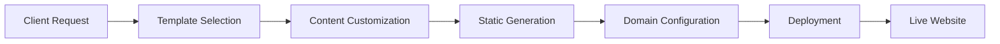

# 🌐 BizoSaaS Multi-Domain Architecture Documentation

## 📋 Executive Summary

BizoSaaS now operates as a comprehensive multi-domain platform supporting multiple product lines and client services. This architecture enables:

- **Primary Platform**: `bizosaas.com` - Core marketing automation SaaS
- **AI Assistant Product**: `aiassist.io` - Personal productivity assistant 
- **Trading Bot Product**: `quanttrade.ai` - Future algorithmic trading platform
- **Client Websites**: `*.bizosaas.com` - Automated website generation for clients
- **Development Access**: Local and staging environments

## 🏗️ Architecture Overview

### Core Services Deployed

| Service | Purpose | Port | Status | Domain Access |
|---------|---------|------|--------|---------------|
| **BizoSaaS Backend** | Main API and business logic | 8000 | ✅ Running | `api.bizosaas.com` |
| **Website Builder** | Automated client site generation | 3001 | ✅ Running | `websites.bizosaas.com` |
| **AI Assistant** | Personal productivity assistant | 8008 | ✅ Running | `aiassist.io` |
| **Domain Manager** | Multi-domain provisioning | 8006 | ✅ Configured | Internal service |
| **Strapi CMS** | Content management system | 1337 | ✅ Running | `admin.bizosaas.com` |
| **Frontend** | React/Next.js application | 3000 | ✅ Running | `bizosaas.com` |

### Domain Strategy

#### 1. **bizosaas.com** - Primary Marketing Platform
```yaml
Primary Functions:
  - Main SaaS platform access
  - Client onboarding and dashboards  
  - Marketing automation services
  - Campaign management interfaces

Subdomains:
  - api.bizosaas.com: Backend API services
  - admin.bizosaas.com: Administrative interfaces
  - websites.bizosaas.com: Website builder API
  - *.bizosaas.com: Client websites (free tier)
```

#### 2. **aiassist.io** - AI Personal Assistant Product
```yaml
Primary Functions:
  - Standalone AI assistant product
  - Personal productivity automation
  - Task and email management
  - Voice and text interfaces

Subdomains:
  - api.aiassist.io: AI assistant API
  - *.aiassist.io: Personalized user instances
```

#### 3. **quanttrade.ai** - Future Trading Platform
```yaml
Primary Functions:
  - Algorithmic trading platform (future)
  - Portfolio management
  - Trading bot services
  - Financial data analysis

Status: Infrastructure ready, implementation pending
```

### Service Integration Architecture

```yaml
Multi-Domain Service Mesh:
├─────────────────────────────────────────────────────────────
│                 Ingress Layer (Multi-Domain)               │
│  ┌─────────────┐  ┌─────────────┐  ┌─────────────┐        │
│  │bizosaas.com │  │ aiassist.io │  │quanttrade.ai│        │
│  │& subdomains │  │& subdomains │  │& subdomains │        │
│  └─────────────┘  └─────────────┘  └─────────────┘        │
├─────────────────────────────────────────────────────────────
│                    Service Layer                           │
│  ┌─────────────┐  ┌─────────────┐  ┌─────────────┐        │
│  │ BizoSaaS    │  │ Website     │  │ AI Personal │        │
│  │ Backend     │  │ Builder     │  │ Assistant   │        │
│  │ (Port 8000) │  │ (Port 3001) │  │ (Port 8008) │        │
│  └─────────────┘  └─────────────┘  └─────────────┘        │
│  ┌─────────────┐  ┌─────────────┐  ┌─────────────┐        │
│  │ Strapi CMS  │  │ Domain      │  │ Frontend    │        │
│  │ (Port 1337) │  │ Manager     │  │ (Port 3000) │        │
│  │             │  │ (Port 8006) │  │             │        │
│  └─────────────┘  └─────────────┘  └─────────────┘        │
├─────────────────────────────────────────────────────────────
│                   Data Layer                               │
│  ┌─────────────┐  ┌─────────────┐  ┌─────────────┐        │
│  │ PostgreSQL  │  │ Redis       │  │ File        │        │
│  │ (Shared)    │  │ Cache       │  │ Storage     │        │
│  │ Multi-DB    │  │ Sessions    │  │ Templates   │        │
│  └─────────────┘  └─────────────┘  └─────────────┘        │
└─────────────────────────────────────────────────────────────
```

## 🚀 Deployment Architecture

### Kubernetes Infrastructure

#### Namespace: `bizosaas-dev`
```yaml
Resource Allocation:
  CPU Requests: 1000m (1 CPU)
  CPU Limits: 3000m (3 CPUs)
  Memory Requests: 2Gi
  Memory Limits: 6Gi
  Pods: 20 maximum
  Services: 30 maximum
```

#### Service Deployments
```yaml
High Availability Configuration:
  - Horizontal Pod Autoscaling (HPA) enabled
  - Rolling update deployments
  - Health checks and probes
  - Network policies for security
  - Resource quotas and limits
```

### Ingress Configuration

#### Production Domains
```nginx
# Primary Platform
bizosaas.com -> BizoSaaS Frontend (Port 3000)
api.bizosaas.com -> BizoSaaS Backend (Port 8000) 
admin.bizosaas.com -> Strapi CMS (Port 1337)
websites.bizosaas.com -> Website Builder (Port 3001)

# AI Assistant Product  
aiassist.io -> AI Assistant Service (Port 8008)
api.aiassist.io -> AI Assistant API (Port 8008)

# Future Trading Platform
quanttrade.ai -> Backend Service (Port 8000) [Placeholder]
```

#### Development Access
```nginx
# Local Development
localhost -> Frontend (Port 3000)
localhost/api -> Backend (Port 8000)
localhost/website-builder -> Website Builder (Port 3001)
localhost/ai-assistant -> AI Assistant (Port 8008)

# Local Domain Testing
bizosaas.local -> Frontend with full API access
```

#### Client Website Routing
```nginx
# Free Tier Examples (Subdomains)
demo-business.bizosaas.com -> Website Builder (Port 3001)
sample-restaurant.bizosaas.com -> Website Builder (Port 3001)
portfolio-creative.bizosaas.com -> Website Builder (Port 3001)

# AI Assistant User Instances
demo-user.aiassist.io -> AI Assistant (Port 8008)
```

## 🔧 Website Builder Service

### Template System

```yaml
Available Templates:
  business-modern:
    name: "Modern Business"
    features: [responsive, contact-form, gallery, testimonials]
    pages: [home, about, services, contact]
    
  restaurant:
    name: "Restaurant & Food"  
    features: [menu, reservations, gallery, location]
    pages: [home, menu, about, contact, reservations]
    
  portfolio:
    name: "Creative Portfolio"
    features: [portfolio, blog, contact-form]  
    pages: [home, portfolio, about, blog, contact]
    
  consulting:
    name: "Professional Services"
    features: [services, testimonials, booking, blog]
    pages: [home, services, about, testimonials, contact]
```

### API Endpoints

```javascript
// Website Builder API
POST /api/v1/websites
GET /api/v1/websites/:website_id
GET /api/v1/clients/:client_id/websites
GET /api/v1/templates
GET /preview/:website_id

// Status and Health
GET /api/health
GET /api/ready
GET /api/v1/status
```

### Website Generation Process



## 🤖 AI Personal Assistant Integration

### Architecture Integration

```yaml
Database Integration:
  - Dedicated PostgreSQL database: ai_personal_assistant
  - Shared infrastructure connection
  - Vector embeddings with pgvector
  - Multi-tenant user isolation

Service Features:
  - Natural language processing
  - Task management automation  
  - Email processing and responses
  - Calendar integration
  - Voice interface support
```

### API Integration

```javascript
// AI Assistant API
GET /api/v1/status
POST /api/v1/chat
GET /api/v1/tasks
POST /webhooks/telegram
POST /webhooks/n8n

// Health Monitoring
GET /health
GET /ready
```

## 🌍 Domain Management Strategy

### Client Website Plans

#### Free Tier
```yaml
Domain Type: Subdomain
Format: {client-slug}.bizosaas.com
Features:
  - BizoSaaS branding
  - Template selection
  - Basic customization
  - Standard support
  
Examples:
  - johndoe-consulting.bizosaas.com
  - marias-restaurant.bizosaas.com
  - creative-portfolio.bizosaas.com
```

#### Pro Tier  
```yaml
Domain Type: Custom Domain
Format: client-owned-domain.com
Features:
  - Custom domain connection
  - SSL certificate management
  - Full branding control
  - Advanced customization
  - Priority support
  
Examples:
  - johndoeconsulting.com
  - mariasrestaurant.com
  - myportfolio.com
```

### Domain Provisioning Process

```yaml
Subdomain Creation:
  1. Client selects business name
  2. System generates slug (sanitized)
  3. DNS record created automatically
  4. SSL certificate issued
  5. Website deployed and accessible

Custom Domain Setup:
  1. Client provides domain name
  2. DNS configuration instructions provided
  3. Domain verification process
  4. SSL certificate provisioning
  5. Website migration and testing
```

## 📊 Service Health Monitoring

### Health Check Endpoints

```yaml
Service Status Monitoring:
  /health - Basic health check
  /ready - Readiness probe  
  /api/v1/status - Detailed status

Database Connectivity:
  - PostgreSQL connection tests
  - Redis cache verification
  - Service-to-service communication

Performance Metrics:
  - Response time monitoring
  - Error rate tracking
  - Resource utilization
  - Scaling events
```

### Monitoring Dashboards

```yaml
Internal Health Dashboard:
  health.bizosaas.local/backend
  health.bizosaas.local/website-builder  
  health.bizosaas.local/ai-assistant
  health.bizosaas.local/domain-manager

Development Monitoring:
  - Pod status and logs
  - Service discovery
  - Ingress routing verification
  - Database connection pooling
```

## 🔐 Security Architecture

### Multi-Tenant Security

```yaml
Database Security:
  - Row-level security (RLS)
  - Tenant isolation at data layer
  - Encrypted connections (SSL/TLS)
  - API key encryption

Network Security:
  - Network policies per service
  - Ingress-level access control
  - CORS configuration
  - Rate limiting middleware
```

### Authentication Strategy

```yaml
JWT Implementation:
  - Service-specific JWT secrets
  - Multi-domain token validation
  - Session management via Redis
  - API key authentication for services

Security Headers:
  - Content Security Policy (CSP)
  - X-Frame-Options: DENY
  - HTTPS redirect enforcement
  - XSS protection headers
```

## 🚀 Deployment Process

### Current Status

```bash
# Check all services
kubectl get pods -n bizosaas-dev

# Verify ingress routing
kubectl get ingress -n bizosaas-dev

# Monitor service health  
kubectl logs -f deployment/website-builder-service -n bizosaas-dev
kubectl logs -f deployment/ai-assistant-lightweight -n bizosaas-dev
```

### Scaling Configuration

```yaml
Horizontal Pod Autoscaling:
  website-builder-service:
    min: 1, max: 3
    CPU target: 70%
    Memory target: 80%
    
  ai-assistant-lightweight:
    min: 1, max: 2  
    CPU target: 70%
    Memory target: 75%
    
  bizosaas-backend-simple:
    min: 1, max: 2
    CPU target: 80%
    Memory target: 85%
```

## 📈 Business Impact

### Multi-Product Strategy

```yaml
Revenue Streams:
  1. BizoSaaS Platform: Marketing automation SaaS
  2. Website Builder: Client website services
  3. AI Assistant: Personal productivity product
  4. Trading Bot: Financial services (future)

Client Value Proposition:
  - Integrated ecosystem of business tools
  - Seamless data and workflow integration
  - Scalable pricing tiers
  - Cross-product synergies
```

### Growth Metrics

```yaml
Technical Scalability:
  - Multi-domain architecture supports unlimited products
  - Microservices enable independent scaling
  - Shared infrastructure optimizes costs
  - Automated deployment pipelines

Business Scalability:
  - Modular service architecture
  - Independent product development
  - Shared customer base growth
  - Cross-selling opportunities
```

## 🔮 Future Roadmap

### Immediate Next Steps

```yaml
Phase 1 - Infrastructure Completion:
  - SSL certificate automation (Let's Encrypt)
  - Advanced monitoring and alerting
  - Backup and disaster recovery
  - Performance optimization

Phase 2 - Product Enhancement:
  - Enhanced AI assistant features
  - Advanced website templates
  - Custom domain automation
  - User dashboard improvements

Phase 3 - New Product Integration:
  - Trading bot platform development
  - ThrillRing integration (entertainment)
  - CorelDove services integration
  - Enterprise features rollout
```

### Technology Evolution

```yaml
Platform Enhancements:
  - GraphQL API gateway
  - Event-driven architecture
  - Advanced caching strategies
  - Real-time collaboration features

AI/ML Integration:
  - Enhanced AI agent capabilities
  - Predictive analytics
  - Automated optimization
  - Natural language interfaces
```

## 📚 Developer Resources

### Development Environment Setup

```bash
# Clone repository
git clone <repository-url>
cd bizosaas

# Check shared infrastructure
npm run check:shared

# Start project services
npm run start:shared

# Access services locally
curl http://localhost:3000                    # Frontend
curl http://localhost:8000/health             # Backend
curl http://localhost:3001/api/health         # Website Builder
curl http://localhost:8008/health             # AI Assistant
```

### Testing Multi-Domain Setup

```bash
# Add to /etc/hosts for local testing
127.0.0.1 bizosaas.local
127.0.0.1 api.bizosaas.local  
127.0.0.1 aiassist.local
127.0.0.1 demo-business.bizosaas.local

# Test domain routing
curl http://bizosaas.local                    # Frontend
curl http://api.bizosaas.local/health         # Backend API
curl http://aiassist.local/api/v1/status      # AI Assistant
```

### API Documentation

```yaml
Comprehensive API docs available at:
  - /docs - Interactive Swagger/OpenAPI
  - /redoc - ReDoc documentation  
  - /api/v1/status - Service status endpoints
  - /api/health - Health check endpoints
```

---

**Last Updated**: 2025-08-26  
**Architecture Version**: 2.0  
**Status**: ✅ Deployed and Operational

This multi-domain architecture positions BizoSaaS as a comprehensive business platform ecosystem, enabling rapid product expansion and enhanced client value delivery.