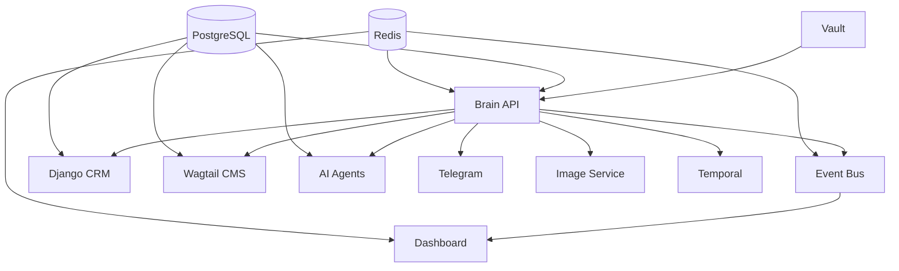

# BizOSaaS Platform - Enhanced Multi-Container Deployment

**Updated: 2025-09-13**  
**Version: 2.0.0**  
**Architecture: Multi-Container with Vault Integration**

## Overview

This deployment configuration represents the enhanced BizOSaaS platform with comprehensive multi-tenant support, HashiCorp Vault secrets management, and advanced Event Bus integration. All services now route through the Central Brain API for unified business logic management.

## 🏗️ Architecture Components

### Core Infrastructure
- **🧠 Brain API** (`bizosaas-brain`) - Central FastAPI service with unified tenant management
- **🔐 HashiCorp Vault** (`vault`) - Secrets management and tenant-aware storage
- **📨 Event Bus** (`event-bus`) - Advanced tenant isolation and event management
- **📊 Unified Dashboard** (`unified-dashboard`) - Enhanced admin interface with real-time updates

### Backend Services
- **🗃️ Django CRM** (`django-crm`) - Customer relationship management with Brain API integration
- **📄 Wagtail CMS** (`wagtail-cms`) - Content management system with tenant support
- **🤖 AI Agents** (`ai-agents`) - CrewAI multi-agent system with event publishing
- **📱 Telegram Integration** (`telegram-integration`) - Multi-bot support with approval workflows
- **🖼️ Image Integration** (`image-integration`) - Multi-provider image service
- **⚡ Temporal Workflows** (`temporal-workflows`) - Python workflow orchestration

## 🚀 Key Features

### Multi-Tenancy
- **Unified Tenant Middleware** - Standardized tenant resolution across all services
- **Vault-Based Tenant Storage** - Secure, cached tenant configuration management
- **Cross-Service Tenant Synchronization** - Consistent tenant context throughout the platform

### Security & Secrets
- **HashiCorp Vault Integration** - Centralized secrets management
- **Service-to-Service Authentication** - Secure communication between microservices
- **Tenant-Aware Permissions** - Row-level security and resource isolation

### Event Management
- **Advanced Tenant Isolation** - Secure multi-tenant event processing
- **Real-Time Event Streaming** - Live updates across the platform
- **Event Audit Trail** - Comprehensive logging and compliance

### AI & Automation
- **Intelligent Agent Orchestration** - CrewAI-powered business automation
- **Event-Driven AI Workflows** - AI agents triggered by business events
- **Telegram Mobile Approvals** - Mobile workflow approval system

## 🔧 Deployment Instructions

### Prerequisites
1. **Dokploy Platform** - Running and configured
2. **Shared Infrastructure** - PostgreSQL and Redis must be available
3. **Domain Configuration** - DNS records for all subdomains
4. **SSL Certificates** - Let's Encrypt configured in Traefik

### Quick Start
```bash
# 1. Clone the configuration
cd /path/to/dokploy/projects

# 2. Copy environment template
cp .env.example .env

# 3. Configure environment variables
nano .env

# 4. Deploy to Dokploy
dokploy deploy --project bizosaas-platform
```

### Environment Configuration
Copy `.env.example` to `.env` and configure:

#### Essential Variables
```bash
# Database & Redis (from shared infrastructure)
POSTGRES_PASSWORD=your_secure_password
REDIS_PASSWORD=your_redis_password

# JWT & Security
JWT_SECRET_KEY=your_super_secure_jwt_key
SERVICE_SECRET=your_service_secret

# AI API Keys
OPENAI_API_KEY=your_openai_key
ANTHROPIC_API_KEY=your_anthropic_key

# Telegram Bot Tokens (5 bots)
TELEGRAM_JONNYAI_BOT_TOKEN=your_bot_token
# ... (see .env.example for all bots)
```

## 🌐 Service Endpoints

### Production Domains
- **🧠 Brain API**: `https://api.bizoholic.com`
- **📊 Admin Dashboard**: `https://admin.bizoholic.com`
- **🗃️ CRM System**: `https://crm.bizoholic.com`
- **📄 CMS System**: `https://cms.bizoholic.com`
- **📨 Event Bus**: `https://events.bizoholic.com`
- **🤖 AI Agents**: `https://agents.bizoholic.com`
- **🔐 Vault**: `https://vault.bizoholic.com`
- **📱 Telegram Bots**: `https://bots.bizoholic.com`
- **🖼️ Image Service**: `https://images.bizoholic.com`
- **⚡ Automation**: `https://automation.bizoholic.com`

### Health Checks
```bash
# Check all services
curl https://api.bizoholic.com/health

# Check specific components
curl https://api.bizoholic.com/health/vault
curl https://api.bizoholic.com/health/event-bus
curl https://api.bizoholic.com/health/ai-agents
```

## 🔄 Service Dependencies



## 📊 Monitoring & Observability

### Available Metrics
- **Service Health** - Individual service status and performance
- **Event Metrics** - Event publishing, processing, and tenant isolation stats
- **AI Agent Performance** - Agent execution times and success rates
- **Tenant Activity** - Per-tenant usage and resource consumption

### Dashboard Features
- **Real-Time Service Status** - Live health monitoring
- **Event Stream Visualization** - Real-time event flow
- **Tenant Management** - Multi-tenant administration
- **AI Agent Control Panel** - Agent monitoring and configuration

## 🔐 Security Features

### Vault Integration
- **Dynamic Secrets** - Automatic credential rotation
- **Tenant-Scoped Secrets** - Isolated secret storage per tenant
- **Service Authentication** - Token-based service communication

### Tenant Isolation
- **Row-Level Security** - Database-level tenant separation
- **Event Filtering** - Tenant-aware event processing
- **Resource Limits** - Per-tenant usage controls

## 🚨 Troubleshooting

### Common Issues

#### Vault Connection Issues
```bash
# Check Vault status
curl http://vault:8200/v1/sys/health

# Verify token
export VAULT_TOKEN=bizosaas-vault-dev-token-2025
vault status
```

#### Event Bus Problems
```bash
# Check Event Bus health
curl https://events.bizoholic.com/health

# Verify tenant isolation
curl https://api.bizoholic.com/api/events/test-integration
```

#### Brain API Issues
```bash
# Check Brain API health
curl https://api.bizoholic.com/health

# Test unified tenant resolution
curl https://api.bizoholic.com/api/unified-tenants/resolve-test
```

### Logs Access
```bash
# View service logs
docker logs bizosaas-brain
docker logs bizosaas-event-bus
docker logs bizosaas-vault

# Follow logs in real-time
docker logs -f bizosaas-brain
```

## 🔄 Updates & Maintenance

### Rolling Updates
```bash
# Update specific service
dokploy deploy --service bizosaas-brain

# Update entire platform
dokploy deploy --project bizosaas-platform
```

### Backup Procedures
- **Vault Data**: Automated backup of secrets to encrypted storage
- **Database**: Shared infrastructure handles PostgreSQL backups
- **Configuration**: Version-controlled in Git repository

## 📞 Support

### Documentation
- **API Documentation**: `https://api.bizoholic.com/brain/docs`
- **Event Bus API**: `https://events.bizoholic.com/docs`
- **Vault UI**: `https://vault.bizoholic.com/ui`

### Contact
- **Technical Issues**: Check service health endpoints first
- **Deployment Problems**: Review Dokploy logs and service dependencies
- **Security Concerns**: Verify Vault connectivity and token validity

---

**Platform Status**: ✅ Production Ready  
**Security Level**: 🔐 Enterprise  
**Scalability**: 📈 Multi-Tenant Ready  
**Integration**: 🔗 Unified Architecture